# BUYMORE ERP — State Machine Diagrams

## Purchase Request (PR)

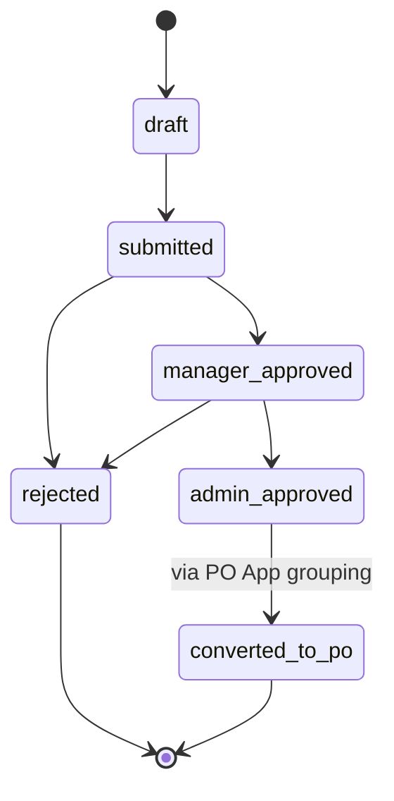

> **Note:** The PO App supports grouping multiple `admin_approved` PRs from the same vendor into a single PO.

---

## Purchase Order (PO)

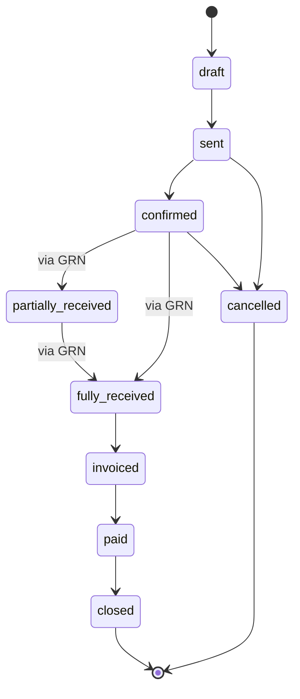

---

## Inbound Order (IO) — LINE-Based Purchasing

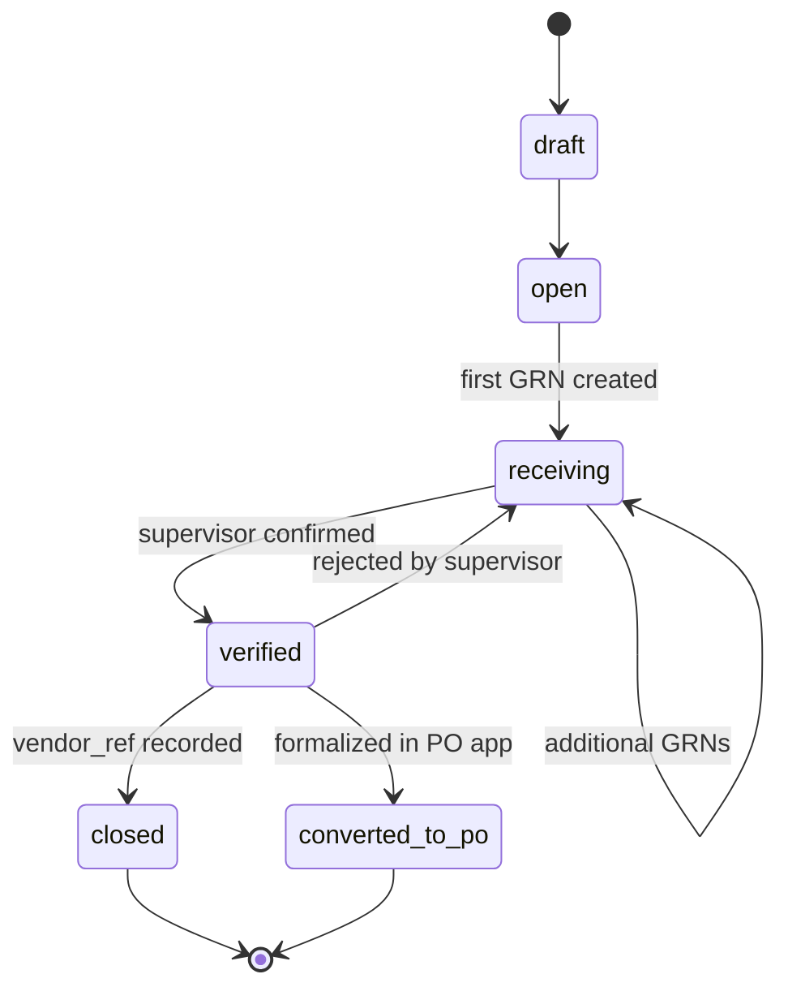

---

## Goods Receipt Note (GRN)

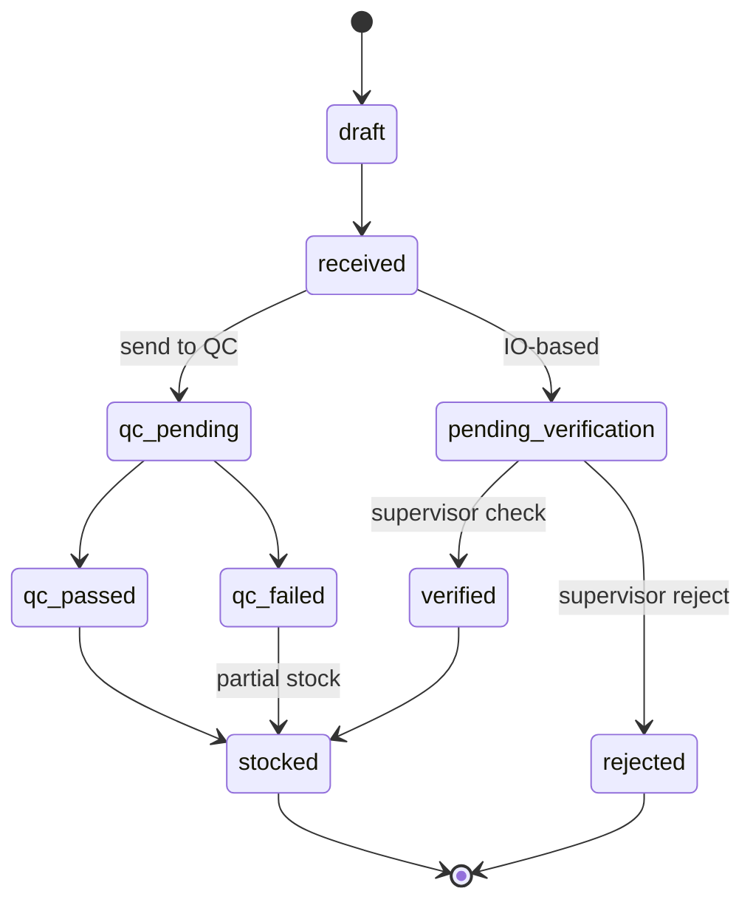

---

## RMA / Claim

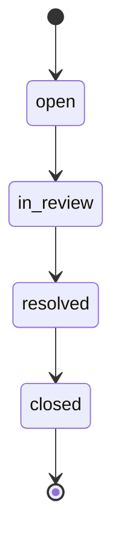

---

## Transfer

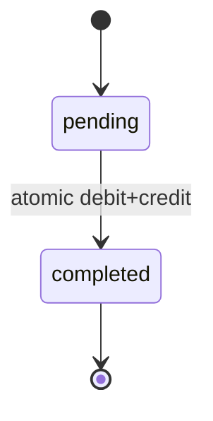

---

## Cycle Count

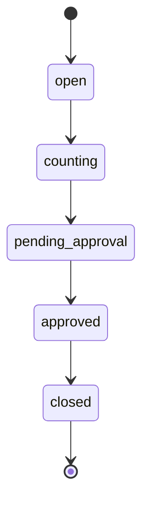

---

## POS Session

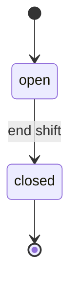

---

## Sales Flow (SQ → SO → DO → SI → SR)

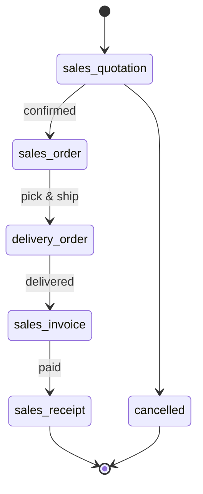

---

## HR Leave Request

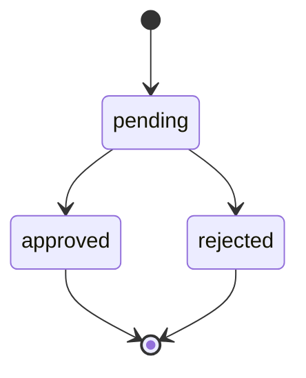

---

## Business Rules (Updated)

- **Action-Driven Refresh:** UI updates immediately after save/approve/delete. No polling (15s removed).
- **ATA (Actual Time of Arrival):** Automatically defaults to current local date in GRN.
- **PR Grouping:** PO app groups PRs by vendor; creating a PO saves vendor choice to `products` table.
- **VAT:** `VAT_RATE = 0.07` in `lib/constants.ts`. All amounts THB. Never hardcode `0.07`.
- **Transfer:** atomic — debit source + credit destination in single transaction.
- **Cycle count approval:** stored proc `apply_cycle_count()` — never replicate in app code.
- **PO status:** auto-updates to `partially_received` / `fully_received` after GRN stocking.
- **Stock ledger:** insert-only. Trigger `sync_stock_balances()` auto-fires. Never UPDATE/DELETE.
- **Document numbers:** `next_doc_number(prefix, seq)` in PostgreSQL only — never app-side.
- **UUID Data Targeting:** Every record uses UUIDs for precise sync across modules.

| Transition | Min Role |
|---|---|
| PR: submit | staff |
| PR: manager_approved | manager |
| PR: admin_approved | admin |
| PO: sent, invoiced, paid, closed, cancelled | manager |
| IO: verify | supervisor |
| GRN: stocked | warehouse_staff |
| Transfer: complete | warehouse_staff |

---

## HR Payroll Run

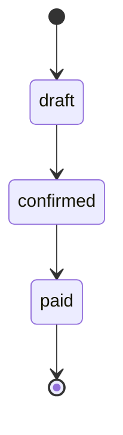
