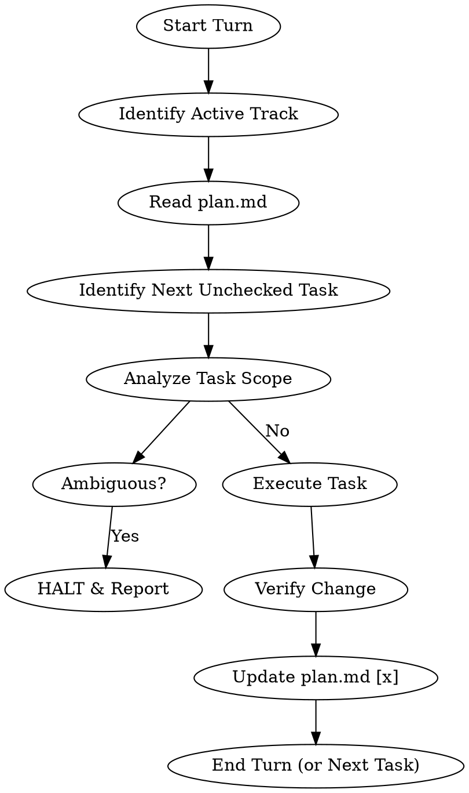

# Conductor Protocol

## Overview
The Conductor Protocol is a hybrid AI workflow where **Claude (The Architect)** plans and **Gemini (The Implementer)** executes. This skill ensures strict adherence to the safety and coordination rules defined in `conductor/PROTOCOLS.md`.

## When to Use
- When starting an "Active" track from `conductor/index.md`.
- When following a `plan.md` in a track folder.
- When reporting results in `execution-summary.md`.

## Core Rules

### 1. Surgical Execution
**Strictly do not modify files or refactor code unrelated to the current Task.**
- Focus ONLY on the current task's objective.
- Do NOT fix "typos" in other files.
- Do NOT add "just-in-case" exports or imports.
- **Violation is a breaking change to the protocol.**

### 2. Zero Assumptions (HALT Rule)
**If the plan is ambiguous or contradictory, HALT immediately.**
- Do not guess.
- Ask the Architect (via the user) for clarification.
- Identify missing dependencies or variables before starting.

### 3. Step-by-Step Updates
**Update the `plan.md` checkbox [x] immediately after completing each task.**
- Ensure the state of the plan reflects the actual codebase at all times.

### 4. Full-Track Execution
**Execute the entire track per `Go` command.**
- Complete ALL unchecked tasks in the plan before stopping.
- After completing all tasks + knowledge capture, STOP and wait for the next command.
- Do NOT proceed to a different track automatically.
- Check off each task as it completes — do not batch checkboxes at the end.

### 5. Reporting
**Create or update `execution-summary.md` only after completing all tasks in the track.**
- Include technical justifications for any necessary deviations.

## Rationalization Table

| Excuse | Reality |
|--------|---------|
| "It's a small fix nearby." | Violates Surgical Execution. Causes sync issues. |
| "I'll update all boxes at once." | Violates Step-by-Step. Architect loses visibility. |
| "The plan probably meant X." | Violates Zero Assumptions. Guessing leads to bugs. |
| "I'm under a deadline." | Quality and protocol sync are more important than speed. |

## Red Flags - STOP and HALT
- "I'll just fix this quick while I'm here."
- "The plan didn't say to do X, but it's probably needed."
- "I'll update the checkboxes at the end."
- "I can do the next task too, it's easy."

## Implementation Flow

