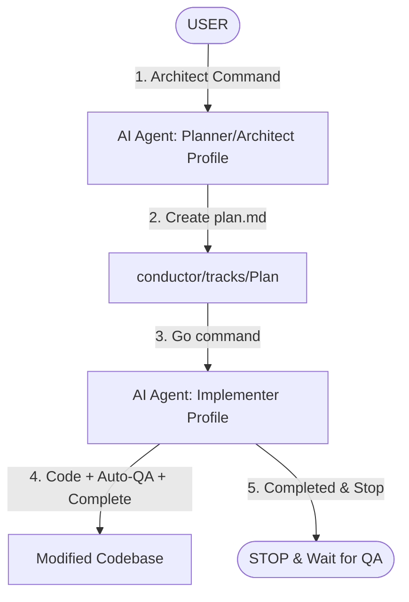

# 🚀 BUYMORE ERP — Unified AI Agent Workflow Guide

คู่มือกลางสำหรับ AI Agents ทุกระบบ (Gemini, Claude, Codex, etc.) เพื่อควบคุมการทำงานร่วมกันภายใต้ **Unified Agentic Architecture** เพื่อป้องกันภาวะ Context Loss และรักษามาตรฐานระดับสูงสุด

---

## 📌 1. Pre-Flight Checklist (ขั้นตอนการโหลด Context ก่อนเริ่มงาน)
**ต้องทำเป็นสิ่งแรกก่อนเริ่มวางแผนหรือเขียนโค้ด!**

1. **Sync Codebase:** `git pull origin master` && `npm run track:sweep`
2. **Master Brain:** อ่าน `docs/skills/universal_agent_rules.md` (มาตรฐานกลาง) และ `docs/SCHEMA.md` (ข้อมูลฐานข้อมูลล่าสุด)
3. **Agent Memory:** 
   - อ่าน `_notes/02_Agent_Memory/current-state.md` (สถานะงานและ API ล่าสุด)
   - อ่าน `_notes/02_Agent_Memory/pitfalls.md` (กับดักที่ต้องระวัง)
4. **Load Skills On-Demand:** โหลดกฎเฉพาะทางตามเนื้องาน (Frontend, Backend, SQL, etc.) จาก `docs/skills/`
6. **File Exploration:** ตรวจสอบไฟล์ที่จะแก้ไขจริงด้วยการค้นหา/อ่านล่วงหน้า ห้ามอ้างอิงจากแผนอย่างเดียว

---

## 👥 2. Core Roles & Behavior Profiles (บทบาทและโปรไฟล์พฤติกรรมมาตรฐาน)

ระบบนี้ขับเคลื่อนด้วย **Unified Agentic Architecture** ซึ่งมีรูปแบบการทำงานและการแบ่งหน้าที่อย่างเด็ดขาดตามคำสั่งที่ได้รับ **ไม่ว่าจะเป็น Claude, Gemini, Codex หรือ AI ตัวใดในอนาคต** ทุกตัวจะทำงานตามมาตรฐานเดียวกันเมื่อสวมบทบาทในแต่ละโปรไฟล์ ดังนี้:

> **Role-based rule:** ชื่อ Chen, Gemini, Billy, Claude, Codex เป็นชื่อ role/surface เพื่อสื่อสารเท่านั้น ไม่ใช่ข้อจำกัดทางเครื่องมือ หากผู้ใช้สั่งให้ agent ใดทำงานใน mode นั้น agent นั้นต้องทำตาม workflow และเขียน artifact ในตำแหน่งเดียวกัน



### 1️⃣ Planner / Architect Profile (โปรไฟล์ผู้วางแผนและออกแบบระบบ)
* **หน้าที่หลัก:** รับโจทย์ความต้องการจาก User -> วิเคราะห์สถาปัตยกรรมระดับกว้าง -> ออกแบบ Zod Schema / TypeScript interfaces ที่รัดกุม -> สร้างแผนและเขียนโครงร่างงานลงใน `plan.md` -> ตรวจสอบแก้ไขเมื่อเกิดข้อผิดพลาดในการตรวจสอบย้อนกลับ (Rework)
* **สิทธิ์การแก้ไขไฟล์:** เขียนได้เฉพาะไฟล์แผนงานใน `conductor/tracks/` และเอกสารสถาปัตยกรรมใน `_notes/01_Decisions/` เท่านั้น **(ห้ามลงมือแก้ไขโค้ดการทำงานหลักในขั้นตอนนี้)**

### 2️⃣ Implementer Profile (โปรไฟล์ผู้ลงมือโค้ดและทดสอบ)
* **หน้าที่หลัก:** โค้ดตามแผนที่วางไว้ใน `plan.md` แบบ Surgical Edit -> รันการคอมไพล์และตรวจสอบข้อผิดพลาดทันที -> ทำการตรวจสอบและแก้ไขตัวเอง (Self-Correcting Loop) ร่วมกับ `npm run qa:verify` จนสะอาด 100% -> สรุปรายงาน `execution-summary.md`
* **สิทธิ์การแก้ไขไฟล์:** แก้ไขโค้ดของระบบตามขอบเขตงาน, อัปเดตเช็คลิสต์ใน `plan.md`, อัปเดตประวัติการทำใน `_notes/02_Agent_Memory/current-state.md` และเขียนรายงานดีบั๊กใน `_notes/04_Debug_Log/` **(ห้ามเปลี่ยนแปลงแผนการทำงานโครงสร้างใหญ่ตามอำเภอใจ)**

### 3️⃣ QA Auditor Profile (โปรไฟล์ผู้ตรวจสอบและออกรายงานผล)
* **หน้าที่หลัก:** รันตรวจสอบ Static checks เชิงลึกและทดสอบคุณภาพของระบบ -> ตรวจความสอดคล้องระหว่างการเขียนโค้ดกับสเปก Zod/API ใน `plan.md` -> เขียนรายงานประเมินข้อผิดพลาดส่งให้ Architect ตัดสินใจทำ Rework Plan

---

## ⚡ 3. Command Triggers & Execution Loop (คำสั่งและวงจรการทำงานมาตรฐานของทุก AI)

> [!IMPORTANT]
> **กฎเหล็กของทุก AI:** ทุกโมเดลจะต้องทำความเข้าใจและยอมรับคำสั่ง (Triggers) พร้อมทั้งรูปแบบการทำงานเหล่านี้ให้ตรงกัน 100% โดยไม่มีการทึกทักเอาเอง

### 🔹 คำสั่ง: `Init`
* **ผู้รับผิดชอบ:** AI Agent ทุกตัวในเซสชันใหม่
* **หน้าที่:** โหลดบริบทและประเมินความพร้อมของระบบทั้งหมดทันที:
  1. รัน `git pull origin master` เพื่อดึงข้อมูลล่าสุดจาก Remote
  2. รัน `npm run track:sweep` เพื่อกวาดเก็บแทร็กที่ถูก `Verified` แล้วเข้าสารบบ Archive
  3. โหลดและอ่านข้อตกลงและหลักการทำงานของ Agent (`docs/skills/agent-principles.md`)
  4. ดึงความจำระบบและจุดผิดพลาดทั่วไป (`current-state.md`, `pitfalls.md`)
  5. รายงานสรุปสถานะความพร้อม (DB columns ล่าสุด, API ล่าสุด, แทร็กค้าง) ให้ User ทราบเพื่อรอคำสั่งถัดไป

### 🔹 คำสั่ง: `Architect: <requirement>`
* **ผู้รับผิดชอบ:** AI Agent ตัวที่ได้รับมอบหมายให้ออกแบบแผน
* **หน้าที่:** วิเคราะห์สถาปัตยกรรมและกำหนดรายละเอียดลงในแผน:
  1. สร้างโฟลเดอร์แทร็กใหม่ (บังคับรันคำสั่ง `mkdir -p` ล่วงหน้าบนสภาพแวดล้อม Windows เสมอ)
  2. สร้างและเขียนสเปกแบบละเอียดลงใน `plan.md` ตามที่ระบุในหัวข้อที่ 4 (Zod schema, DB constraints, transactions)
  3. เพิ่มรายการแทร็กในสารบัญ `conductor/index.md` ให้เป็นสถานะ `Active`

### 🔹 คำสั่ง: `Go` (วงจรการทำงานแบบสมบูรณ์และหยุดทันที)
* **ผู้รับผิดชอบ:** AI Agent ตัวที่เริ่มรันขั้นตอนการเขียนโค้ด (ทำงานในบทบาท Implementer)
* **กระบวนการทำงานและลูปตรวจสอบตัวเอง (MANDATORY EXECUTION LOOP):**
  เมื่อได้รับคำสั่ง `Go` ไม่ว่าจะเป็น Claude, Gemini หรือ Codex **ต้องดำเนินการตามขั้นตอนเหล่านี้อย่างต่อเนื่องจนเสร็จสิ้น และห้ามหยุดกลางคันจนกว่าสถานะจะสะอาด 100%**:

```
[พิมพ์ Go]
   │
   ▼
1. สร้าง Branch ใหม่สำหรับ Track: `git checkout -b feat/<track-id>`
   │
   ▼
2. ค้นหา Track แรกที่มีสถานะ 'Active' หรือ 'Rework Required' ใน conductor/index.md
   │
   ▼
3. ดำเนินการแก้ไขโค้ด (Surgical Edit) ตาม Tasks ทั้งหมดใน plan.md
   │
   ▼
4. เขียน Unit Test ที่ **assert behavior จริง** สำหรับ Logic ที่สำคัญ (Vitest) — Hard-Rule #8. ห้าม `.skip`/ลบ test เพื่อให้ผ่าน, ห้าม `eslint-disable local-rules/*` เพื่อหนี lint (principle B3). `qa:verify` ผ่านทั้งที่ไม่มี test ใหม่ = ยังไม่เสร็จ (principle B2)
   │
   ▼
5. รัน KNOWLEDGE ELEVATION (Context Protection):
   - อัปเดต `_notes/02_Agent_Memory/current-state.md` (DB facts, API routes, Migration numbers)
   - อัปเดต `_notes/02_Agent_Memory/pitfalls.md` (ถ้ามี trap ใหม่)
   - อัปเดตไฟล์โมดูลใน `_notes/00_Project_Map/modules/`
   │
   ▼
6. รันตรวจสอบ Auto-QA:
   - รันตรวจสอบความถูกต้องผ่าน `npm run qa:verify` (Linter + TypeScript + Tests + check:notes)
   - `check:notes` ต้องผ่าน 100% (ห้ามมี undocumented routes หรือ migration mismatch)
   - ตรวจสอบความถูกต้องกับ `docs/skills/qa_audit_rules.md`
   - หลังอัปเดตสถานะ/เอกสารแล้วต้องรัน `npm run agent:closeout` เพื่อกวาด track, ตรวจ Obsidian links, และบล็อกไฟล์ scratch/data/lint artifacts ที่เผลอถูก track
   │
   ├─► [มีข้อผิดพลาด/มีจุดเสีย/Lints/TypeScript Error/Tests Fail/Doc Missing]
   │    │
   │    ▼
   │    ดำเนินการแก้ไขทันที (Auto-Fix/Rework) -> วนกลับไปรัน Step 5 ใหม่ (จำกัดสูงสุด 3 รอบ)
   │
   └─► [สะอาด 100% - ไม่มี Error และยกระดับความรู้ลง Obsidian ครบถ้วน]
        │
        ▼
7. ปิดงาน Implementer และหยุด:
   - ปรับสถานะ Track ใน index.md และ frontmatter ของ plan.md เป็น `Completed` เมื่อ implementation + `qa:verify` ผ่าน
   - ห้าม Implementer ตั้งสถานะ `Verified`; `Verified` ทำได้เฉพาะหลังคำสั่ง `QA-Review: <track>` ตรวจหลักฐานแล้วเท่านั้น
   - เขียนไฟล์ `execution-summary.md` ตามรูปแบบที่กำหนด
   │
   ▼
8. 🚨 กฎเหล็กการหยุดทำงาน (STRICT STOP CONDITION):
   - ห้ามก้าวไปทำ Track ถัดไปโดยพลการเด็ดขาด!
   - เขียน Session Report ส่งให้ผู้ใช้งาน และหยุดทำงาน (STOP) ทันที
   - แนะนำให้ผู้ใช้ "Reset Session" (ปิดแชทแล้วเปิดใหม่) เพื่อเริ่ม Track ถัดไปด้วย Context ที่สะอาด
```

### 🔹 คำสั่ง: `Summary`
* **ผู้รับผิดชอบ:** AI Agent ที่ทำหน้าที่โค้ด
* **หน้าที่:** ตรวจสอบความเรียบร้อยและสรุปหลักฐานการทำงานลงใน `execution-summary.md` ในโฟลเดอร์ของ Track โดยระบุรายละเอียดส่วนที่แก้ไขจริง (Surgical Evidence)

### 🔹 คำสั่ง: `QA: <track-name>`
* **ผู้รับผิดชอบ:** AI Agent ที่ทำหน้าที่ตรวจสอบ
* **หน้าที่:** รันเครื่องมือตรวจสอบ static checks, ประเมินความถูกต้องตามสเปกใน `plan.md` และสร้าง Draft QA Report ที่ `conductor/qa-reports/<track-name>.md` เท่านั้น ห้ามเขียน `rework-plan.md` หรือปรับสถานะ track ใน Auditor draft mode

### 🔹 คำสั่ง: `QA-Review: <track-name>`
* **ผู้รับผิดชอบ:** AI Agent ที่รับบทบาทเป็น Architect/Planner
* **หน้าที่:** คัดกรองจุดตรวจสอบของ QA Auditor -> ยืนยันหรือคัดออกผลตรวจสอบ -> ร่างแผนแก้ไข `rework-plan.md` และเปลี่ยนสถานะ Track เป็น `Rework Required` หรือเมื่อไม่มี Must Fix เหลือให้เปลี่ยนสถานะเป็น `Verified` แล้วรัน `npm run track:sweep`

---

## 📋 4. Planning Format (`plan.md` Specification)

แผนการทำงานที่สร้างโดย Chen ใน `conductor/tracks/<feature-name>/plan.md` จะต้องมีองค์ประกอบเหล่านี้อย่างครบถ้วน:

### 1. YAML Frontmatter
```yaml
---
track: feature-name
title: "คำอธิบายแทร็กอย่างสั้น"
status: Active # Active | Planned | Completed | Rework Required | Verified
created: YYYY-MM-DD
updated: YYYY-MM-DD
---
```

### 2. Mandatory Architectural Gates
งานแก้ไขที่เกี่ยวข้องกับ API หรือ Database จะต้องมี 6 ข้อนี้ระบุในงานเสมอ:
1. **Transaction Boundary:** ระบุ `BEGIN` / `COMMIT` / `ROLLBACK` สำหรับทุก API ที่มีการเซฟข้อมูลหลายตาราง
2. **Doc Number Generation:** เรียกใช้ฟังก์ชัน `next_doc_number('PREFIX', 'sequence_name')` จากฝั่ง PostgreSQL เท่านั้น ห้าม Gen ฝั่ง Application
3. **Child Table Inserts:** หากมีข้อมูลหัวข้อหลักคู่กับรายการย่อย ต้องระบุโครงสร้างการทำงานแบบ:
   - INSERT Parent -> Get `parent_id` -> `FOR EACH` child: INSERT child พร้อม `parent_id`
4. **Side Effects & Stock Integrity:** สำหรับการเปลี่ยนสถานะใดๆ ต้องระบุผลกระทบที่ตามมา เช่น การบันทึก `stock_ledger` และการอัปเดตยอดคงเหลือ
5. **Testing Strategy:** ระบุ **ชื่อไฟล์ test + behavior ที่ assert** สำหรับทุก task ที่มี business logic (Hard-Rule #8 / PROTOCOLS Plan Quality Gate #6). "เขียน test" ลอย ๆ โดยไม่ระบุ assertion = prose ที่จะ rot ไม่นับว่าพร้อม
6. **Response Shape:** ระบุ Zod Schema หรือ TypeScript Interface ของ Data ที่ส่งกลับจาก `apiSuccess()` หรือรับเข้าทาง Body อย่างชัดเจน

---

## 🔍 5. QA & Rework Plan Format (`rework-plan.md` Specification)

เมื่อแผนต้องการการ Rework, ไฟล์ `rework-plan.md` จะต้องเขียนตามโครงสร้างดังนี้:

```markdown
# Rework Plan — <track-name>
**QA Date:** YYYY-MM-DD · **Auditor:** Billy (draft) · Chen (validated) · **Build:** PASS|FAIL

## Changes from Billy's Draft
| Finding | Billy's Classification | Chen's Decision | Reason |
|---------|------------------------|-----------------|--------|
| file:line | Must Fix | Confirmed / Dismissed | ... |

## 🔴 Must Fix
- [ ] **File:** `path/to/file.tsx:line` — **Issue:** คำอธิบายปัญหา **Fix:** สิ่งที่ต้องดำเนินการแก้ไขให้ตรงสเปก

## 🟡 Should Fix
- [ ] **File:** `path/to/file.tsx:line` — **Issue:** สิ่งที่ควรปรับปรุง **Fix:** แนวทางแก้ไข

## Verified Correct
*รายการที่ตรวจสอบแล้วว่าถูกต้อง*

## Future Track Suggestions
*ข้อเสนอแนะสำหรับการวางแผนในแทร็กถัดไป (ป้องกัน Scope Creep)*
```

---

## 🗂️ 6. Obsidian Integration & Note-Taking System

โปรเจกต์นี้เปิด Obsidian Vault คลุมทั้ง Repository โดยมีระเบียบการเขียนบันทึกตามหมวดหมู่ดังนี้:

### 🗺️ Obsidian Folder Map & Responsibilities

| สิ่งที่ต้องการบันทึก | เส้นทางไฟล์ (Path) | ผู้รับผิดชอบ (Role) | กฎเกณฑ์ที่ต้องปฏิบัติตาม |
| :--- | :--- | :--- | :--- |
| **Track เสร็จสิ้น / คอลัมน์ DB ใหม่ / API route ใหม่** | `_notes/02_Agent_Memory/current-state.md` | **ทุก Agent**  | อัปเดตหลังจากปิด Track สำเร็จ ย้าย Track ที่เสร็จเข้า "Last 5 Completed Tracks" และลบออกจาก "Active Work" |
| **การตัดสินใจเชิงสถาปัตยกรรม (Architecture Decision)** | `_notes/01_Decisions/<topic-name>.md` | **Architect / QA Reviewer role**  | บันทึกเฉพาะโครงสร้างใหญ่ ๆ ห้าม implementer เขียนโค้ดทับสเปกที่กำหนดไว้ที่นี่ |
| **สาเหตุของบั๊กและการแก้ไขเชิงลึก (Bug Root Cause & Complex Fix)** | `_notes/04_Debug_Log/<YYYY-MM-DD>-<topic>.md` | **ทุก Agent** | เขียนเฉพาะกรณีที่เจอบั๊กที่ยากและหาวิธีการแก้ที่ไม่ธรรมดา เพื่อเป็นแนวทางในอนาคต |
| **การค้นพบจุดบกพร่องทั่วไป / Traps ใหม่** | `_notes/02_Agent_Memory/pitfalls.md` | **ทุก Agent** | อัปเดตเพื่อจดจำ generic traps ที่อาจส่งผลกระทบต่อสถาปัตยกรรมและการพัฒนา |
| **กฎมาตรฐานแยกตามหัวข้อทางเทคนิค** | `docs/skills/<skill_rules>.md` | **ทุก Agent** | ปรับปรุงพฤติกรรม รูปแบบ หรือ Pattern โค้ดที่นำกลับมาใช้ใหม่ได้ |

### 🚨 กฎเหล็กของ Obsidian
1. **ห้ามยุ่งกับโฟลเดอร์ควบคุม:** AI ทุกตัว **ห้ามเขียนหรือแก้ไข** ข้อมูลในโฟลเดอร์ `.obsidian/` และ `_notes/daily/` เด็ดขาด
2. **ประหยัดเนื้อที่ Context:** การบันทึกข้อมูลต้องเป็นแบบ **High-Signal, Low-Noise** กระชับและมีเนื้อหาสำคัญจริง ๆ ไม่เขียนข้อความพรรณนาเยิ่นเย้อ ให้มุ่งเน้นที่ Code Schema, Column, API path และเหตุผลทางเทคนิค

---

## 🎯 7. Zero-Tolerance Development Rules (กฎเหล็กห้ามละเมิด)

1. **TypeScript Strictness:** ห้ามใช้ `as any` โดยไม่มีข้อยกเว้นเด็ดขาด! ให้สร้าง Interface/Type ที่ถูกต้อง หรือใช้ `as unknown as T` เฉพาะตอนเชื่อม NextAuth types เท่านั้น
2. **Stock Ledger is Insert-Only:** ตาราง `stock_ledger` ห้ามสั่ง `UPDATE` หรือ `DELETE` โดยเด็ดขาด การทำงานต้องผ่านการแทรกรายการเพื่อปรับมูลค่า/จำนวนเท่านั้น
3. **No Unbounded SQL Queries:** การดึงรายการข้อมูลผ่าน SQL query ต้องมี `LIMIT` และ `OFFSET` กำกับเสมอ
4. **No Code Placeholders:** ห้ามปล่อยทิ้งคอมเมนต์เช่น `// TODO`, `// FIXME`, `// intentionally omitted` ไว้ในไฟล์งานที่ทำเสร็จแล้วอย่างเด็ดขาด! หากมีอยู่จะไม่สามารถติ๊กอนุมัติ `[x]` บนเช็คลิสต์ได้
5. **Read Before Edit:** ทุกครั้งก่อนจะแก้ไขไฟล์ใด ๆ ต้องใช้เครื่องมือ `view_file` อ่านโค้ดในไฟล์นั้นให้เข้าใจโครงสร้างทั้งหมดเสียก่อน ห้ามคาดเดาและเขียนทับโค้ดเดิมแบบไม่มีหลักการ
6. **Zero-Emission compilation:** ก่อนเปลี่ยนสถานะ Track เป็น Completed ต้องรัน `npx tsc --noEmit` และ `npm run lint` แล้วมีข้อผิดพลาดเป็น 0 เท่านั้น
7. **No Gaming The Gate:** ห้ามทำให้ check ผ่านโดยละเมิดเจตนา — ไม่มี `eslint-disable local-rules/*`, ไม่มี `catch {}` ว่าง (ต้อง log + surface error), ไม่ลบ/`.skip` test เพื่อให้ suite เขียว (principle B3).
8. **Errors Must Surface:** กฎ "ห้าม console.*" เล็งที่ debug noise ไม่ใช่ error handling — `catch` ต้อง `console.error`/logger เสมอ (principle B5).

> **Enforcement note:** กฎทั้งหมดข้างบนมี mapping → gate → status ใน [universal_agent_rules.md §3](skills/universal_agent_rules.md). กฎที่ยังเป็น `manual-interim` ต้องตรวจด้วยมือทุก track จนกว่า `hardening-t2-ci-gate` จะเพิ่ม automated gate. กฎไม่มี gate = suggestion ที่จะ rot (agent-principles Part B).
