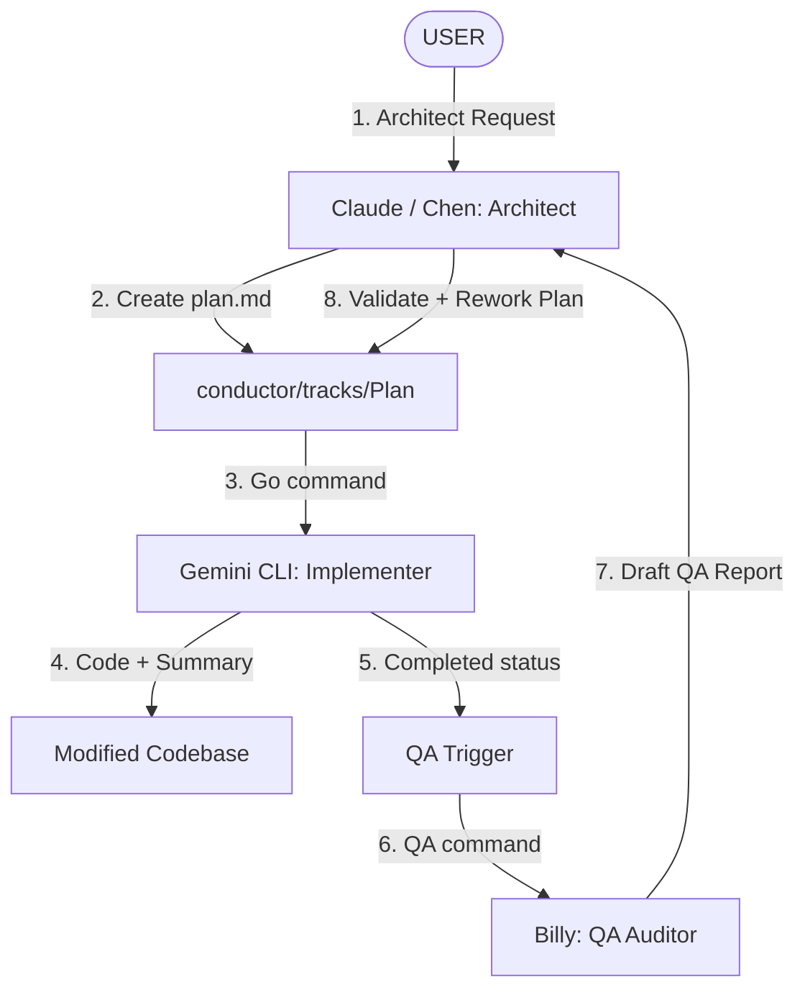

# 🚀 BUYMORE ERP — Central AI Agent Workflow & Coordination Guide

คู่มือกลางสำหรับ AI Agents ทุกตัว (Claude/Chen, Gemini, Billy) เพื่อควบคุมการทำงานร่วมกัน ป้องกันภาวะ Context Loss และรักษามาตรฐานสถาปัตยกรรมของระบบ BUYMORE ERP (Next.js 15 + PostgreSQL)

---

## 📌 1. Pre-Flight Checklist (ขั้นตอนการโหลด Context ก่อนเริ่มงาน)
**ต้องทำเป็นสิ่งแรกก่อนเขียนโค้ดหรือวางแผนแม้แต่บรรทัดเดียว!**

1. **Sync Codebase:**
   ```bash
   git pull origin master
   ```
   *เหตุผล: ป้องกัน Push Conflict และป้องกันข้อมูลล้าสมัยจากการ Commit ของ AI ตัวอื่น*
2. **Archiving Sweep:**
   ```bash
   npm run track:sweep
   ```
   *เหตุผล: ทำความสะอาด active track ที่ผ่านการ Verify แล้ว ย้ายเข้าสู่ Archive อย่างเป็นระเบียบ*
3. **Read Agent Principles:** อ่าน `docs/skills/agent-principles.md` (รวม Karpathy Guidelines)
4. **Read Agent Memory:** 
   - อ่าน `_notes/02_Agent_Memory/current-state.md` เพื่อดู Active Work, การเปลี่ยนแปลง DB ล่าสุด, API routes ใหม่ และ Migration Number ล่าสุด
   - อ่าน `_notes/02_Agent_Memory/pitfalls.md` เพื่อเรียนรู้ Workflow Traps ล่าสุด
5. **Load Skills On-Demand:** โหลดเฉพาะคู่มือที่เกี่ยวกับเนื้องานหลักของ Task นั้น ๆ (ห้ามโหลดพร้อมกันหลายไฟล์เพื่อประหยัด Token):
   - **Frontend UI / Tailwind:** `docs/skills/frontend_ui_rules.md`
   - **Backend API / Zod:** `docs/skills/backend_api_rules.md`
   - **Database SQL / pg:** `docs/skills/database_sql_rules.md`
   - **QA Audit / Lint:** `docs/skills/qa_audit_rules.md`
   - **Vercel / Serverless:** `docs/skills/vercel_rules.md`
6. **File Exploration:** ตรวจสอบไฟล์ที่จะแก้ไขจริงด้วยการค้นหา/อ่านล่วงหน้า ห้ามอ้างอิงจากแผนอย่างเดียว

---

## 👥 2. Core Roles (บทบาทและการแบ่งหน้าที่ของ AI)

โปรเจกต์นี้ใช้ระบบ Hybrid AI Workflow มีการแบ่งแยกหน้าที่การทำงานอย่างชัดเจนเพื่อป้องกันสับสน:



### 1️⃣ Claude / Chen (The Architect & Planner)
* **หน้าที่หลัก:** รับโจทย์จาก User -> วิเคราะห์สถาปัตยกรรม -> วางแผนและเขียนแผนการทำงานลงใน `plan.md` -> ตรวจสอบและอนุมัติผล QA จาก Billy -> ออกแผนแก้ไข `rework-plan.md`
* **สิทธิ์การเขียน Obsidian:** เขียนสเปกใน `conductor/tracks/` และสรุปการตัดสินใจใน `_notes/01_Decisions/` เท่านั้น **(ห้ามเขียนโค้ดหลักเด็ดขาด)**

### 2️⃣ Gemini CLI (The Implementer)
* **หน้าที่หลัก:** อ่านแผน `plan.md` -> เขียนโค้ดตามแผนแบบ Surgical Edit -> รันการทดสอบและแกะบั๊ก -> ตรวจสอบ Auto-QA -> สรุปรายงาน `execution-summary.md`
* **สิทธิ์การเขียน Obsidian:** อัปเดตเช็คลิสต์ใน `plan.md`, อัปเดตประวัติการทำใน `_notes/02_Agent_Memory/current-state.md` **(ห้ามวางแผนโครงสร้างใหม่เองเด็ดขาด)**

### 3️⃣ Billy (The QA Auditor)
* **หน้าที่หลัก:** รันตรวจสอบ Static checks (`npm run lint`, `npx tsc --noEmit`) -> ทำการ Deep Audit เทียบโค้ดที่แก้ไขกับสเปกใน `plan.md` -> เขียน Draft QA Report ที่ `conductor/qa-reports/<track>.md`
* **สิทธิ์การเขียน Obsidian:** เขียนรายงานผลตรวจสอบเท่านั้น **(ห้ามแก้โค้ด และห้ามอัปเดตไฟล์ดัชนี)**

---

## ⚡ 3. Command Triggers & Execution Loop (คำสั่งและวงจรการทำงาน)

### 🔹 คำสั่ง: `Init`
* **ผู้รับผิดชอบ:** AI ทุกตัว (ในเซสชันใหม่)
* **หน้าที่:** เมื่อได้รับคำสั่งนี้ AI จะรัน **Pre-Flight Checklist** เต็มรูปแบบทันที:
  1. รัน `git pull origin master` เพื่อซิงค์โค้ดก่อนเริ่ม
  2. รัน `npm run track:sweep` เพื่อกวาดเก็บแทร็กที่เสร็จแล้วเข้า Archive
  3. โหลดและอ่านไฟล์การประสานงานหลัก (`README.md`, `docs/skills/ai_workflow_rules.md`)
  4. ดึงความจำระบบล่าสุดและกลหลีกเลี่ยงข้อผิดพลาด (`current-state.md`, `pitfalls.md`)
  5. ตรวจสอบกระดานคิวงานหลัก `conductor/index.md`
  6. รายงานสรุปความพร้อมของระบบ (DB ล่าสุด, Migration, แทร็กค้าง) ให้ผู้ใช้งานทราบทันทีเพื่อรอทริกเกอร์ถัดไป (`Architect:` หรือ `Go`)

### 🔹 คำสั่ง: `Architect: <requirement>`
* **ผู้รับผิดชอบ:** Claude/Chen
* **หน้าที่:** เมื่อได้รับคำสั่งนี้ Chen จะเริ่มทำ **Pre-Planning Checklist** และสร้างห้องทำงานใหม่ (Track Folder) พร้อมสร้างไฟล์ `plan.md` และอัปเดตสถานะใน `conductor/index.md` ให้เป็น `Active` หรือ `Planned`
* **วิธีการสร้างโฟลเดอร์บน Windows/OneDrive:** บังคับสร้างโฟลเดอร์ด้วย Bash `mkdir -p` ก่อนใช้เครื่องมือ Write เสมอ ป้องกันการทำงานล้มเหลว:
  ```bash
  mkdir -p "/c/Users/AKRA-Panich-Front/OneDrive/02-2 - AKRA/projectERP/conductor/tracks/<feature-name>"
  ```

### 🔹 คำสั่ง: `Go`
* **ผู้รับผิดชอบ:** Gemini CLI
* **หน้าที่:** ทำงานตามแผนงานทีละแผนงาน (Track) เมื่อเจอคำสั่งนี้ โดยจะค้นหา Track แรกที่มีสถานะ `Active` หรือ `Rework Required` ใน `conductor/index.md` ดำเนินการตามแผนและทดสอบจนเสร็จสิ้น จากนั้นบันทึกและหยุดทำงานทันที (ห้ามก้าวไปทำ Track ถัดไปโดยอัตโนมัติ):
  1. ทำตาม Tasks ใน `plan.md` หรือ `rework-plan.md` ของ Track ปัจจุบันเท่านั้น
  2. เขียน `execution-summary.md`
  3. ตรวจสอบ Auto-QA: รันตรวจสอบ static type และ lint และประเมินผลเทียบกับความต้องการ
  4. **หากพบข้อผิดพลาด:** ดำเนินการ Rework ตามแผนและแก้ทันทีจนสมบูรณ์
  5. **หากผ่าน 100%:** ปรับสถานะเป็น `Completed` หรือ `Verified` และหยุดการประมวลผลทันทีเพื่อรอคำสั่ง Go ครั้งถัดไป

### 🔹 คำสั่ง: `Summary`
* **ผู้รับผิดชอบ:** Gemini CLI
* **หน้าที่:** เขียนไฟล์ `execution-summary.md` ในโฟลเดอร์ของ Track โดยระบุรายละเอียดและหลักฐานที่ผ่านการแก้ไขจริง (Surgical Evidence)

### 🔹 คำสั่ง: `QA: <track-name>`
* **ผู้รับผิดชอบ:** Billy (QA Auditor)
* **หน้าที่:** รัน Lint & Build และประเมินผลเทียบกับ `plan.md` เพื่อสร้างรายงานข้อผิดพลาด `[DRAFT — Pending Chen Validation]` ที่ `conductor/qa-reports/<track-name>.md`

### 🔹 คำสั่ง: `QA-Review: <track-name>`
* **ผู้รับผิดชอบ:** Chen (Claude/Architect)
* **หน้าที่:** อ่านรีพอร์ตดราฟต์ของ Billy -> ตรวจสอบเทียบกับโค้ดจริง -> คัดกรองและจัดลำดับระดับความสำคัญ (Confirmed, Downgraded, Dismissed) -> เขียนไฟล์ `rework-plan.md` และปรับสถานะใน `conductor/index.md` เพื่อส่งกลับให้ Gemini ทำ Rework

---

## 📋 4. Planning Format (`plan.md` Specification)

แผนการทำงานที่สร้างโดย Chen ใน `conductor/tracks/<feature-name>/plan.md` จะต้องมีองค์ประกอบเหล่านี้อย่างครบถ้วน:

### 1. YAML Frontmatter
```yaml
---
track: feature-name
title: "คำอธิบายแทร็กอย่างสั้น"
status: Active # Active | Planned | Completed | Rework Required | Verified
created: YYYY-MM-DD
updated: YYYY-MM-DD
---
```

### 2. Mandatory Architectural Gates
งานแก้ไขที่เกี่ยวข้องกับ API หรือ Database จะต้องมี 5 ข้อนี้ระบุในงานเสมอ:
1. **Transaction Boundary:** ระบุ `BEGIN` / `COMMIT` / `ROLLBACK` สำหรับทุก API ที่มีการเซฟข้อมูลหลายตาราง
2. **Doc Number Generation:** เรียกใช้ฟังก์ชัน `next_doc_number('PREFIX', 'sequence_name')` จากฝั่ง PostgreSQL เท่านั้น ห้าม Gen ฝั่ง Application
3. **Child Table Inserts:** หากมีข้อมูลหัวข้อหลักคู่กับรายการย่อย ต้องระบุโครงสร้างการทำงานแบบ:
   - INSERT Parent -> Get `parent_id` -> `FOR EACH` child: INSERT child พร้อม `parent_id`
4. **Side Effects & Stock Integrity:** สำหรับการเปลี่ยนสถานะใดๆ ต้องระบุผลกระทบที่ตามมา เช่น การบันทึก `stock_ledger` (เป็นตาราง INSERT-ONLY ห้าม UPDATE/DELETE) และการอัปเดตยอดคงเหลือ
5. **Response Shape:** ระบุ Zod Schema หรือ TypeScript Interface ของ Data ที่ส่งกลับจาก `apiSuccess()` หรือรับเข้าทาง Body อย่างชัดเจน

---

## 🔍 5. QA & Rework Plan Format (`rework-plan.md` Specification)

เมื่อแผนต้องการการ Rework, ไฟล์ `rework-plan.md` จะต้องเขียนตามโครงสร้างดังนี้:

```markdown
# Rework Plan — <track-name>
**QA Date:** YYYY-MM-DD · **Auditor:** Billy (draft) · Chen (validated) · **Build:** PASS|FAIL

## Changes from Billy's Draft
| Finding | Billy's Classification | Chen's Decision | Reason |
|---------|------------------------|-----------------|--------|
| file:line | Must Fix | Confirmed / Dismissed | ... |

## 🔴 Must Fix
- [ ] **File:** `path/to/file.tsx:line` — **Issue:** คำอธิบายปัญหา **Fix:** สิ่งที่ต้องดำเนินการแก้ไขให้ตรงสเปก

## 🟡 Should Fix
- [ ] **File:** `path/to/file.tsx:line` — **Issue:** สิ่งที่ควรปรับปรุง **Fix:** แนวทางแก้ไข

## Verified Correct
*รายการที่ตรวจสอบแล้วว่าถูกต้อง*

## Future Track Suggestions
*ข้อเสนอแนะสำหรับการวางแผนในแทร็กถัดไป (ป้องกัน Scope Creep)*
```

---

## 🗂️ 6. Obsidian Integration & Note-Taking System

โปรเจกต์นี้เปิด Obsidian Vault คลุมทั้ง Repository โดยมีระเบียบการเขียนบันทึกตามหมวดหมู่ดังนี้:

### 🗺️ Obsidian Folder Map & Responsibilities

| สิ่งที่ต้องการบันทึก | เส้นทางไฟล์ (Path) | ผู้รับผิดชอบ (Role) | กฎเกณฑ์ที่ต้องปฏิบัติตาม |
| :--- | :--- | :--- | :--- |
| **Track เสร็จสิ้น / คอลัมน์ DB ใหม่ / API route ใหม่** | `_notes/02_Agent_Memory/current-state.md` | **Gemini (Implementer)** เท่านั้น | อัปเดตหลังจากปิด Track สำเร็จ ย้าย Track ที่เสร็จเข้า "Last 5 Completed Tracks" และลบออกจาก "Active Work" |
| **การตัดสินใจเชิงสถาปัตยกรรม (Architecture Decision)** | `_notes/01_Decisions/<topic-name>.md` | **Chen / Claude** เท่านั้น | บันทึกเฉพาะโครงสร้างใหญ่ ๆ ห้าม Gemini เขียนโค้ดทับสเปกที่กำหนดไว้ที่นี่ |
| **สาเหตุของบั๊กและการแก้ไขเชิงลึก (Bug Root Cause & Complex Fix)** | `_notes/04_Debug_Log/<YYYY-MM-DD>-<topic>.md` | **ทุก Agent** | เขียนเฉพาะกรณีที่เจอบั๊กที่ยากและหาวิธีการแก้ที่ไม่ธรรมดา เพื่อเป็นแนวทางในอนาคต |
| **การค้นพบจุดบกพร่องทั่วไป / Traps ใหม่** | `_notes/02_Agent_Memory/pitfalls.md` | **ทุก Agent** | อัปเดตเพื่อจดจำ generic traps ที่อาจส่งผลกระทบต่อสถาปัตยกรรมและการพัฒนา |
| **กฎมาตรฐานแยกตามหัวข้อทางเทคนิค** | `docs/skills/<skill_rules>.md` | **ทุก Agent** | ปรับปรุงพฤติกรรม รูปแบบ หรือ Pattern โค้ดที่นำกลับมาใช้ใหม่ได้ |

### 🚨 กฎเหล็กของ Obsidian
1. **ห้ามยุ่งกับโฟลเดอร์ควบคุม:** AI ทุกตัว **ห้ามเขียนหรือแก้ไข** ข้อมูลในโฟลเดอร์ `.obsidian/` และ `_notes/daily/` เด็ดขาด
2. **ประหยัดเนื้อที่ Context:** การบันทึกข้อมูลต้องเป็นแบบ **High-Signal, Low-Noise** กระชับและมีเนื้อหาสำคัญจริง ๆ ไม่เขียนข้อความพรรณนาเยิ่นเย้อ ให้มุ่งเน้นที่ Code Schema, Column, API path และเหตุผลทางเทคนิค

---

## 🎯 7. Zero-Tolerance Development Rules (กฎเหล็กห้ามละเมิด)

1. **TypeScript Strictness:** ห้ามใช้ `as any` โดยไม่มีข้อยกเว้นเด็ดขาด! ให้สร้าง Interface/Type ที่ถูกต้อง หรือใช้ `as unknown as T` เฉพาะตอนเชื่อม NextAuth types เท่านั้น
2. **Stock Ledger is Insert-Only:** ตาราง `stock_ledger` ห้ามสั่ง `UPDATE` หรือ `DELETE` โดยเด็ดขาด การทำงานต้องผ่านการแทรกรายการเพื่อปรับมูลค่า/จำนวนเท่านั้น
3. **No Unbounded SQL Queries:** การดึงรายการข้อมูลผ่าน SQL query ต้องมี `LIMIT` และ `OFFSET` กำกับเสมอ
4. **No Code Placeholders:** ห้ามปล่อยทิ้งคอมเมนต์เช่น `// TODO`, `// FIXME`, `// intentionally omitted` ไว้ในไฟล์งานที่ทำเสร็จแล้วอย่างเด็ดขาด! หากมีอยู่จะไม่สามารถติ๊กอนุมัติ `[x]` บนเช็คลิสต์ได้
5. **Read Before Edit:** ทุกครั้งก่อนจะแก้ไขไฟล์ใด ๆ ต้องใช้เครื่องมือ `view_file` อ่านโค้ดในไฟล์นั้นให้เข้าใจโครงสร้างทั้งหมดเสียก่อน ห้ามคาดเดาและเขียนทับโค้ดเดิมแบบไม่มีหลักการ
6. **Zero-Emission compilation:** ก่อนเปลี่ยนสถานะ Track เป็น Completed ต้องรัน `npx tsc --noEmit` และ `npm run lint` แล้วมีข้อผิดพลาดเป็น 0 เท่านั้น
