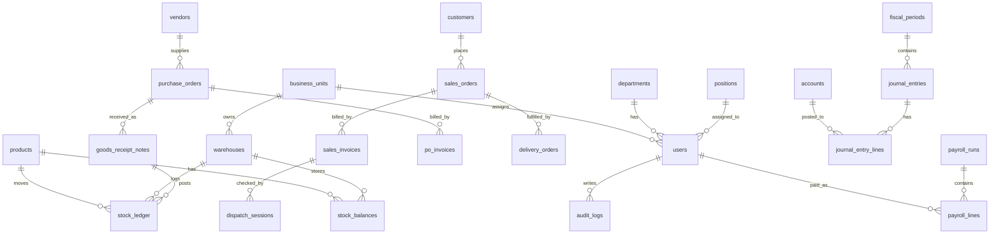
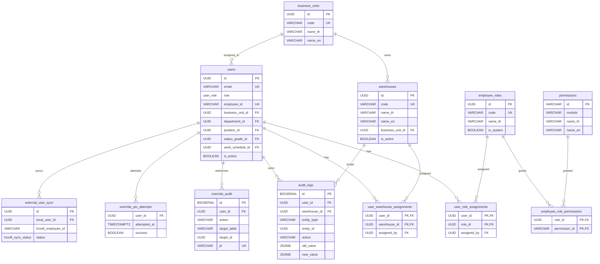

# BUYMORE ERP ERD

Generated from local schema sources on 2026-07-08.

## Current Project Status

Source files reviewed:

- `conductor/index.md`
- `_notes/02_Agent_Memory/current-state.md`
- `docs/SCHEMA.md`
- `migrations/001_enums.sql` through `migrations/074_hr_employee_ops_constraints.sql`
- `git status --short`

Current state:

- App stack: Next.js 15, React 19, TypeScript, PostgreSQL through raw `pg`.
- Latest committed HEAD: `2a85a8d ci(hardening): enforce qa verify gate`.
- Current branch pointer: `feat/hr-employee-ops-foundation`; `feat/hardening-t2-ci-gate` points to the same commit.
- Latest migration in the workspace: `074_hr_employee_ops_constraints.sql`.
- Next migration number expected by current notes: `075_<name>.sql`.
- Active track: `hr-payroll-compensation-governance`.
- Rework track still open: `i18n-t6-menu-remaining`.
- Worktree is not clean. There are modified HR routes/pages/types/i18n/sidebar/docs plus untracked HR Employee Ops files, tests, migrations `073` and `074`, and a new HR payroll governance track plan.

Interpretation:

- Core ERP domains are already broad and mostly verified in the project tracker: WMS, POS, Sales, Accounting, HR, AP, analytics, and integrations.
- The current local workspace is mid-HR-governance work, so treat this ERD as the current local schema intent, not a clean release snapshot.
- `docs/SCHEMA.md` says v072 in its header, but its body already mentions v073 and v074. The physical migration folder is the stronger source of truth.

## ERD Conventions

- `||--o{` means one-to-many.
- `}o--o{` means many-to-many through a bridge table.
- `FK?` means a soft reference or nullable reference where the database may not enforce the FK.
- `reference_type/reference_id` fields are polymorphic references and are intentionally not represented as hard FK edges.
- Diagrams are split by domain because a single diagram for the full schema is not readable.

## High-Level Domain Map



## Core, IAM, and Organization



Notes:

- `users` is both auth account and employee record.
- Warehouse access is normalized through `user_warehouse_assignments`.
- RBAC is separate from the legacy `users.role` enum. `users.role` is still used for broad role semantics.
- `audit_logs.entity_type/entity_id` and `override_audit.target_table/target_id` are polymorphic references.

## Product, UOM, Inventory, WMS, and Repack

```mermaid
erDiagram
  product_categories {
    UUID id PK
    UUID parent_id FK
    VARCHAR code UK
    VARCHAR name_th
    VARCHAR name_en
  }

  units_of_measure {
    UUID id PK
    VARCHAR code UK
    VARCHAR name_th
    VARCHAR name_en
    BOOLEAN is_base_unit
  }

  products {
    UUID id PK
    VARCHAR sku UK
    VARCHAR barcode UK
    UUID category_id FK
    UUID uom_id FK
    NUMERIC unit_cost
    NUMERIC selling_price
    NUMERIC moving_avg_cost
    NUMERIC min_price
    NUMERIC clr_min_price
    BOOLEAN is_lot_tracked
    BOOLEAN is_npd_trial
  }

  product_uom {
    UUID id PK
    UUID product_id FK
    UUID uom_id FK
    NUMERIC conversion_factor
    product_uom_type uom_type
  }

  uom_conversions {
    UUID id PK
    UUID uom_id FK
    UUID base_uom_id FK
    NUMERIC factor
  }

  stock_balances {
    UUID warehouse_id PK,FK
    UUID product_id PK,FK
    NUMERIC qty_on_hand
    NUMERIC qty_reserved
    NUMERIC qty_available
  }

  lots {
    UUID id PK
    UUID product_id FK
    UUID warehouse_id FK
    VARCHAR lot_number
    VARCHAR serial_number
    DATE expiry_date
    NUMERIC qty_on_hand
  }

  stock_ledger {
    BIGSERIAL id PK
    UUID warehouse_id FK
    UUID product_id FK
    UUID lot_id FK
    ledger_entry_type entry_type
    VARCHAR reference_type
    UUID reference_id
    NUMERIC qty_change
    NUMERIC qty_after
    UUID created_by FK
  }

  warehouse_zones {
    UUID id PK
    UUID warehouse_id FK
    VARCHAR code
    warehouse_zone_thermal_type thermal_type
  }

  virtual_locations {
    UUID id PK
    VARCHAR code UK
    virtual_location_purpose purpose
    BOOLEAN is_sellable
    TEXT[] visible_channels
  }

  warehouse_transfers {
    UUID id PK
    VARCHAR transfer_number UK
    UUID source_warehouse_id FK
    UUID dest_warehouse_id FK
    transfer_status status
    UUID initiated_by FK
  }

  warehouse_transfer_lines {
    UUID id PK
    UUID transfer_id FK
    UUID product_id FK
    UUID lot_id FK
    NUMERIC qty
  }

  cycle_counts {
    UUID id PK
    VARCHAR count_number UK
    UUID warehouse_id FK
    cycle_count_status status
    UUID initiated_by FK
    UUID approved_by FK
  }

  cycle_count_lines {
    UUID id PK
    UUID cycle_count_id FK
    UUID product_id FK
    UUID lot_id FK
    NUMERIC qty_system
    NUMERIC qty_counted
  }

  bom_headers {
    UUID id PK
    VARCHAR bom_number UK
    UUID product_id FK
    UUID uom_id FK
    bom_type bom_type
    INTEGER version
  }

  bom_lines {
    UUID id PK
    UUID bom_id FK
    UUID component_id FK
    UUID uom_id FK
    NUMERIC qty_required
  }

  repack_templates {
    UUID id PK
    VARCHAR name_th
    UUID source_product_id FK
    NUMERIC source_qty
  }

  repack_template_items {
    UUID id PK
    UUID template_id FK
    UUID product_id FK
    NUMERIC qty_ratio
  }

  repack_orders {
    UUID id PK
    VARCHAR order_number UK
    UUID source_product_id FK
    UUID warehouse_id FK
    repack_status status
    UUID created_by FK
    UUID closed_je_id FK
  }

  repack_order_items {
    UUID id PK
    UUID repack_order_id FK
    UUID product_id FK
    NUMERIC qty
  }

  product_categories ||--o{ product_categories : parent
  product_categories ||--o{ products : categorizes
  units_of_measure ||--o{ products : base_uom
  products ||--o{ product_uom : alternate_uom
  units_of_measure ||--o{ product_uom : used_by
  units_of_measure ||--o{ uom_conversions : uom
  units_of_measure ||--o{ uom_conversions : base_uom

  warehouses ||--o{ stock_balances : stores
  products ||--o{ stock_balances : has_balance
  warehouses ||--o{ lots : contains
  products ||--o{ lots : tracked_as
  warehouses ||--o{ stock_ledger : ledger_scope
  products ||--o{ stock_ledger : moves
  lots ||--o{ stock_ledger : lot_moves
  users ||--o{ stock_ledger : created_by

  warehouses ||--o{ warehouse_zones : has
  warehouses ||--o{ warehouse_transfers : source
  warehouses ||--o{ warehouse_transfers : destination
  warehouse_transfers ||--o{ warehouse_transfer_lines : lines
  products ||--o{ warehouse_transfer_lines : transferred
  lots ||--o{ warehouse_transfer_lines : lot

  warehouses ||--o{ cycle_counts : counted
  cycle_counts ||--o{ cycle_count_lines : lines
  products ||--o{ cycle_count_lines : counted_product
  lots ||--o{ cycle_count_lines : counted_lot

  products ||--o{ bom_headers : output
  bom_headers ||--o{ bom_lines : components
  products ||--o{ bom_lines : component
  units_of_measure ||--o{ bom_headers : output_uom
  units_of_measure ||--o{ bom_lines : component_uom

  products ||--o{ repack_templates : source
  repack_templates ||--o{ repack_template_items : outputs
  products ||--o{ repack_template_items : output_product
  products ||--o{ repack_orders : source
  warehouses ||--o{ repack_orders : site
  repack_orders ||--o{ repack_order_items : outputs
  products ||--o{ repack_order_items : output_product
```



Inventory invariants:

- `stock_ledger` is intended to be insert-only.
- `stock_balances` is app read-only and derived by transactional updates.
- `qty_available` is generated from on-hand minus reserved stock.
- `stock_ledger.reference_type/reference_id` links to source documents such as GRN, POS, SO delivery, transfer, repack, or adjustment without hard FKs.
- `repack_orders.closed_je_id` is a hard FK to `journal_entries`.

## Purchasing, Receiving, AP, Vendor Claims

```mermaid
erDiagram
  vendors {
    UUID id PK
    VARCHAR code UK
    VARCHAR name_th
    VARCHAR tax_id
    INTEGER payment_terms_days
    NUMERIC default_wht_rate
  }

  vendor_products {
    UUID id PK
    UUID vendor_id FK
    UUID product_id FK
    VARCHAR vendor_sku
    NUMERIC unit_price
  }

  purchase_requisitions {
    UUID id PK
    VARCHAR pr_number UK
    UUID warehouse_id FK
    UUID requested_by FK
    pr_status status
  }

  pr_line_items {
    UUID id PK
    UUID pr_id FK
    UUID product_id FK
    NUMERIC qty_requested
    UUID transaction_uom_id FK
  }

  purchase_orders {
    UUID id PK
    VARCHAR po_number UK
    UUID vendor_id FK
    UUID warehouse_id FK
    po_status status
    UUID created_by FK
    UUID source_grn_id FK
  }

  po_line_items {
    UUID id PK
    UUID po_id FK
    UUID product_id FK
    UUID pr_line_item_id FK
    NUMERIC qty_ordered
    NUMERIC qty_received
  }

  pr_po_links {
    UUID pr_id PK,FK
    UUID po_id PK,FK
  }

  inbound_orders {
    UUID id PK
    VARCHAR io_number UK
    UUID vendor_id FK
    UUID warehouse_id FK
    inbound_order_status status
    UUID parent_io_id FK
    UUID created_by FK
  }

  inbound_order_lines {
    UUID id PK
    UUID io_id FK
    UUID product_id FK
    NUMERIC qty_ordered
    NUMERIC qty_received
  }

  io_po_links {
    UUID io_id PK,FK
    UUID po_id PK,FK
  }

  goods_receipt_notes {
    UUID id PK
    VARCHAR grn_number UK
    grn_source_type source_type
    UUID po_id FK
    UUID inbound_order_id FK
    UUID pr_id FK
    UUID vendor_id FK
    UUID warehouse_id FK
    grn_status status
    UUID split_from_grn_id FK
    INTEGER lift_fee_rounds
    NUMERIC lift_fee_amount
  }

  grn_line_items {
    UUID id PK
    UUID grn_id FK
    UUID po_line_item_id FK
    UUID inbound_order_line_id FK
    UUID pr_line_item_id FK
    UUID product_id FK
    UUID lot_id FK
    NUMERIC qty_received
    NUMERIC qty_accepted
    NUMERIC qty_rejected
  }

  grn_bonus_items {
    UUID id PK
    UUID grn_id FK
    UUID product_id FK
    NUMERIC qty
  }

  blind_receipts {
    UUID id PK
    VARCHAR br_number UK
    UUID po_id FK
    UUID warehouse_id FK
    UUID counted_by FK
    VARCHAR status
    UUID grn_id FK?
  }

  blind_receipt_lines {
    UUID id PK
    UUID blind_receipt_id FK
    UUID product_id FK
    NUMERIC qty_counted
  }

  po_invoices {
    UUID id PK
    UUID po_id FK
    UUID vendor_id FK
    UUID grn_id FK
    VARCHAR invoice_number
    NUMERIC amount
    NUMERIC paid_amount
    match_status match_status
    BOOLEAN voided
  }

  po_invoice_match_variances {
    BIGSERIAL id PK
    UUID po_invoice_id FK
    VARCHAR variance_type
    NUMERIC po_value
    NUMERIC gr_value
    NUMERIC invoice_value
  }

  ap_payments {
    UUID id PK
    VARCHAR payment_number UK
    UUID vendor_id FK
    NUMERIC total_amount
    UUID paid_by FK
  }

  ap_payment_allocations {
    UUID id PK
    UUID payment_id FK
    UUID invoice_id FK
    NUMERIC allocated_amount
  }

  wht_certificates {
    UUID id PK
    UUID vendor_id FK
    UUID payment_id FK
    NUMERIC wht_rate
    NUMERIC wht_amount
    UUID issued_by FK
  }

  rma_requests {
    UUID id PK
    VARCHAR rma_number UK
    UUID vendor_id FK
    UUID warehouse_id FK
    UUID grn_id FK
    UUID po_id FK
  }

  rma_line_items {
    UUID id PK
    UUID rma_id FK
    UUID product_id FK
    UUID lot_id FK
    NUMERIC qty_returned
  }

  vendor_claims {
    UUID id PK
    VARCHAR claim_number UK
    UUID vendor_id FK
    UUID warehouse_id FK
    UUID grn_id FK
    UUID po_id FK
    UUID rma_id FK
    UUID replacement_grn_id FK
  }

  vendor_claim_attachments {
    UUID id PK
    UUID claim_id FK
    VARCHAR file_name
    TEXT file_url
  }

  grn_reversal_log {
    UUID id PK
    UUID grn_id FK
    UUID reversed_by FK
    TEXT reason
  }

  vendors ||--o{ vendor_products : offers
  products ||--o{ vendor_products : supplied_by

  warehouses ||--o{ purchase_requisitions : requested_for
  users ||--o{ purchase_requisitions : requested_by
  purchase_requisitions ||--o{ pr_line_items : lines
  products ||--o{ pr_line_items : requested_product

  vendors ||--o{ purchase_orders : supplies
  warehouses ||--o{ purchase_orders : receives_at
  purchase_orders ||--o{ po_line_items : lines
  products ||--o{ po_line_items : ordered_product
  pr_line_items ||--o{ po_line_items : converted_to
  purchase_requisitions ||--o{ pr_po_links : linked
  purchase_orders ||--o{ pr_po_links : linked

  vendors ||--o{ inbound_orders : sends
  warehouses ||--o{ inbound_orders : receives_at
  inbound_orders ||--o{ inbound_order_lines : lines
  inbound_orders ||--o{ inbound_orders : split_child
  products ||--o{ inbound_order_lines : inbound_product
  inbound_orders ||--o{ io_po_links : linked
  purchase_orders ||--o{ io_po_links : linked

  purchase_orders ||--o{ goods_receipt_notes : received_as
  inbound_orders ||--o{ goods_receipt_notes : received_as
  purchase_requisitions ||--o{ goods_receipt_notes : direct_grn
  vendors ||--o{ goods_receipt_notes : standalone_vendor
  warehouses ||--o{ goods_receipt_notes : received_at
  goods_receipt_notes ||--o{ goods_receipt_notes : split_from
  goods_receipt_notes ||--o{ grn_line_items : lines
  po_line_items ||--o{ grn_line_items : received_line
  inbound_order_lines ||--o{ grn_line_items : received_line
  pr_line_items ||--o{ grn_line_items : direct_line
  products ||--o{ grn_line_items : received_product
  lots ||--o{ grn_line_items : creates_or_links
  goods_receipt_notes ||--o{ grn_bonus_items : bonus
  products ||--o{ grn_bonus_items : bonus_product
  goods_receipt_notes ||--o{ grn_reversal_log : reversed

  purchase_orders ||--o{ blind_receipts : counted_against
  blind_receipts ||--o{ blind_receipt_lines : lines
  products ||--o{ blind_receipt_lines : counted_product

  purchase_orders ||--o{ po_invoices : billed
  vendors ||--o{ po_invoices : vendor
  goods_receipt_notes ||--o{ po_invoices : matched_grn
  po_invoices ||--o{ po_invoice_match_variances : variances
  vendors ||--o{ ap_payments : paid
  ap_payments ||--o{ ap_payment_allocations : allocations
  po_invoices ||--o{ ap_payment_allocations : allocated_to
  vendors ||--o{ wht_certificates : tax_cert
  ap_payments ||--o{ wht_certificates : cert_for

  vendors ||--o{ rma_requests : rma
  rma_requests ||--o{ rma_line_items : lines
  products ||--o{ rma_line_items : returned
  lots ||--o{ rma_line_items : lot
  vendors ||--o{ vendor_claims : claims
  goods_receipt_notes ||--o{ vendor_claims : source_or_replacement
  purchase_orders ||--o{ vendor_claims : source_po
  rma_requests ||--o{ vendor_claims : source_rma
  vendor_claims ||--o{ vendor_claim_attachments : attachments
```

Receiving flow:

1. PR and IO can both feed PO/GRN workflows.
2. GRN can come from PO, inbound order, standalone, or PR-direct via `source_type`.
3. GRN lines can connect to PO lines, inbound-order lines, PR lines, products, lots, and transaction UOM.
4. Stocking a GRN posts stock ledger entries and can update moving average cost.
5. Three-way match stores `po_invoices.match_status` plus detailed rows in `po_invoice_match_variances`.
6. GRN reversal logs reversals in `grn_reversal_log` and marks linked AP invoices `voided`.

## Sales, POS, Dispatch, and Credit

```mermaid
erDiagram
  customers {
    UUID id PK
    VARCHAR code UK
    VARCHAR name_th
    NUMERIC credit_limit
    BOOLEAN on_hold
  }

  sales_quotations {
    UUID id PK
    VARCHAR sq_number UK
    UUID customer_id FK
    UUID warehouse_id FK
    sq_status status
    price_channel channel
  }

  sq_line_items {
    UUID id PK
    UUID sq_id FK
    UUID product_id FK
    NUMERIC qty
    NUMERIC unit_price
  }

  sales_orders {
    UUID id PK
    VARCHAR so_number UK
    UUID customer_id FK
    UUID warehouse_id FK
    so_status status
    price_channel channel
  }

  so_line_items {
    UUID id PK
    UUID so_id FK
    UUID product_id FK
    UUID sq_line_item_id FK
    NUMERIC qty_ordered
    NUMERIC qty_delivered
  }

  so_sq_links {
    UUID so_id PK,FK
    UUID sq_id PK,FK
  }

  delivery_orders {
    UUID id PK
    VARCHAR do_number UK
    UUID so_id FK
    UUID warehouse_id FK
    do_status status
  }

  do_line_items {
    UUID id PK
    UUID do_id FK
    UUID so_line_item_id FK
    UUID product_id FK
    NUMERIC qty_to_deliver
  }

  sales_invoices {
    UUID id PK
    VARCHAR si_number UK
    UUID so_id FK
    UUID delivery_order_id FK
    UUID customer_id FK
    si_status status
    price_channel channel
    INT current_version_no
  }

  invoice_versions {
    UUID id PK
    UUID invoice_id FK
    INT version_no
    VARCHAR barcode
    JSONB change_summary
  }

  sales_returns {
    UUID id PK
    VARCHAR sr_number UK
    UUID so_id FK
    UUID customer_id FK
    UUID warehouse_id FK
    sr_status status
  }

  sr_line_items {
    UUID id PK
    UUID sr_id FK
    UUID product_id FK
    NUMERIC qty_returned
  }

  customer_credit_holds {
    UUID id PK
    UUID customer_id FK
    TEXT reason
    UUID released_by FK
  }

  customer_price_contracts {
    UUID id PK
    UUID customer_id FK
    UUID product_id FK
    NUMERIC locked_price
    NUMERIC discount_pct
  }

  product_prices {
    UUID id PK
    UUID product_id FK
    price_channel channel
    price_tier tier
    NUMERIC price
  }

  product_channel_uoms {
    UUID id PK
    UUID product_id FK
    price_channel channel
    TEXT[] allowed_uoms
  }

  pos_members {
    UUID id PK
    VARCHAR member_number UK
    VARCHAR phone UK
    price_tier price_tier
    INTEGER point_balance
  }

  pos_shifts {
    UUID id PK
    VARCHAR name_th
    VARCHAR shift_number
  }

  pos_sessions {
    UUID id PK
    VARCHAR session_number UK
    UUID warehouse_id FK
    UUID opened_by FK
    UUID closed_by FK
    UUID shift_id FK
    pos_session_status status
  }

  pos_transactions {
    UUID id PK
    VARCHAR receipt_number UK
    UUID session_id FK
    UUID warehouse_id FK
    UUID member_id FK
    UUID shift_id FK
    pos_transaction_status status
    pos_payment_method payment_method
  }

  pos_transaction_lines {
    UUID id PK
    UUID transaction_id FK
    UUID product_id FK
    NUMERIC qty
    UUID transaction_uom_id FK
  }

  pos_held_carts {
    UUID id PK
    VARCHAR hold_number UK
    UUID session_id FK
    UUID warehouse_id FK
    UUID created_by FK
    UUID wholesale_picking_slip_id FK
  }

  pos_held_cart_lines {
    UUID id PK
    UUID held_cart_id FK
    UUID product_id FK
    NUMERIC qty
  }

  pos_picking_slips {
    UUID id PK
    VARCHAR doc_no UK
    UUID draft_cart_id FK
    UUID source_warehouse_id FK
    pos_picking_slip_status status
    JSONB lines
  }

  pick_lists {
    UUID id PK
    TEXT pick_number UK
    UUID sales_order_id FK
    UUID warehouse_id FK
    pick_list_status status
  }

  pick_list_lines {
    UUID id PK
    UUID pick_list_id FK
    UUID product_id FK
    UUID lot_id FK
    VARCHAR fefo_override_jti FK
  }

  shipments {
    UUID id PK
    TEXT shipment_number UK
    UUID pick_list_id FK
    UUID warehouse_id FK
    shipment_status status
  }

  dispatch_sessions {
    UUID id PK
    UUID invoice_id FK
    UUID gate_user_id FK
    dispatch_session_status status
  }

  dispatch_check_log {
    BIGSERIAL id PK
    UUID session_id FK
    UUID invoice_id FK
    UUID product_id FK
    UUID lot_id FK
    dispatch_check_result result
  }

  field_sales_checkins {
    UUID id PK
    UUID agent_user_id FK
    UUID customer_id FK
    NUMERIC gps_lat
    NUMERIC gps_lng
  }

  customers ||--o{ sales_quotations : quoted
  sales_quotations ||--o{ sq_line_items : lines
  products ||--o{ sq_line_items : quoted_product
  customers ||--o{ sales_orders : orders
  sales_orders ||--o{ so_line_items : lines
  sq_line_items ||--o{ so_line_items : source
  sales_orders ||--o{ so_sq_links : linked
  sales_quotations ||--o{ so_sq_links : linked

  sales_orders ||--o{ delivery_orders : deliveries
  delivery_orders ||--o{ do_line_items : lines
  so_line_items ||--o{ do_line_items : delivered_from
  products ||--o{ do_line_items : delivered_product
  sales_orders ||--o{ sales_invoices : invoices
  delivery_orders ||--o{ sales_invoices : invoice_source
  customers ||--o{ sales_invoices : billed
  sales_invoices ||--o{ invoice_versions : versions
  sales_orders ||--o{ sales_returns : returns
  sales_returns ||--o{ sr_line_items : lines
  products ||--o{ sr_line_items : returned_product

  customers ||--o{ customer_credit_holds : credit_holds
  customers ||--o{ customer_price_contracts : contract_prices
  products ||--o{ customer_price_contracts : contract_product
  products ||--o{ product_prices : price_book
  products ||--o{ product_channel_uoms : channel_uom_rules

  warehouses ||--o{ pos_sessions : terminal_site
  pos_shifts ||--o{ pos_sessions : shift
  pos_sessions ||--o{ pos_transactions : transactions
  pos_members ||--o{ pos_transactions : member_purchase
  pos_transactions ||--o{ pos_transaction_lines : lines
  products ||--o{ pos_transaction_lines : sold_product
  pos_sessions ||--o{ pos_held_carts : held_carts
  pos_held_carts ||--o{ pos_held_cart_lines : lines
  products ||--o{ pos_held_cart_lines : held_product
  pos_held_carts ||--o{ pos_picking_slips : picking_slip
  pos_picking_slips ||--o{ pos_held_carts : current_slip

  sales_orders ||--o{ pick_lists : picked_by
  pick_lists ||--o{ pick_list_lines : lines
  products ||--o{ pick_list_lines : picked_product
  lots ||--o{ pick_list_lines : fefo_lot
  pick_lists ||--o{ shipments : shipments
  sales_invoices ||--o{ dispatch_sessions : dispatch_check
  dispatch_sessions ||--o{ dispatch_check_log : scans
  products ||--o{ dispatch_check_log : scanned_product
  lots ||--o{ dispatch_check_log : scanned_lot
  users ||--o{ field_sales_checkins : agent
  customers ||--o{ field_sales_checkins : visited
```



Sales flow:

1. SQ -> SO is represented by `so_sq_links`; individual SO lines may point back to `sq_line_items`.
2. SO -> DO -> SI is the main B2B lifecycle.
3. POS has its own transaction model and stock movement path.
4. Hybrid wholesale POS uses held carts plus `pos_picking_slips`.
5. Dispatch exit-gate checks scan sales invoice content through `dispatch_sessions` and `dispatch_check_log`.
6. Credit hold state lives on `customers.on_hold` with history in `customer_credit_holds`.

## Accounting, Compliance, Analytics, and Integrations

```mermaid
erDiagram
  accounts {
    UUID id PK
    VARCHAR account_code UK
    UUID parent_id FK
    account_type account_type
    normal_balance_type normal_balance
    BOOLEAN allows_direct_posting
  }

  fiscal_periods {
    UUID id PK
    VARCHAR name_th
    VARCHAR name_en
    INTEGER year
    INTEGER month
    fiscal_period_status status
  }

  journal_entries {
    UUID id PK
    VARCHAR entry_number UK
    UUID fiscal_period_id FK
    journal_entry_type entry_type
    VARCHAR reference_type
    UUID reference_id
    journal_entry_status status
    UUID created_by FK
    UUID posted_by FK
  }

  journal_entry_lines {
    UUID id PK
    UUID journal_entry_id FK
    UUID account_id FK
    NUMERIC debit_amount
    NUMERIC credit_amount
  }

  hr_payroll_accounts {
    INT id PK
    UUID salary_expense_account_id FK?
    UUID sso_expense_account_id FK?
    UUID salary_payable_account_id FK?
    UUID sso_payable_account_id FK?
    UUID tax_payable_account_id FK?
  }

  vat_report_runs {
    UUID id PK
    INTEGER period_year
    INTEGER period_month
    vat_report_type report_type
    UUID generated_by FK
    NUMERIC total_base
    NUMERIC total_vat
    JSONB snapshot
  }

  accounting_export_jobs {
    UUID id PK
    VARCHAR format
    DATE range_from
    DATE range_to
    UUID requested_by FK
    VARCHAR status
    JSONB output_meta
  }

  transfer_suggestions {
    UUID id PK
    UUID product_id FK
    UUID source_wh FK
    UUID target_wh FK
    UUID approved_by FK
    UUID transfer_id FK
    UUID je_id FK
    transfer_suggestion_status status
  }

  npd_trials {
    UUID id PK
    UUID product_id FK
    npd_trial_status status
    UUID decision_by FK
  }

  vendor_rebate_contracts {
    UUID id PK
    UUID vendor_id FK
    NUMERIC threshold_amount
    NUMERIC rebate_rate
    rebate_period_type period
  }

  vendor_rebate_accruals {
    UUID id PK
    UUID vendor_id FK
    UUID contract_id FK
    NUMERIC eligible_purchases
    NUMERIC accrued_rebate
    UUID posted_je_id FK
    rebate_accrual_status status
  }

  sku_performance_snapshot {
    UUID product_id
    VARCHAR sku
    NUMERIC qty_on_hand
    NUMERIC qty_sold_30d
    NUMERIC revenue_30d
    NUMERIC gross_margin_30d
    VARCHAR velocity_bucket
  }

  sku_cut_candidates {
    UUID product_id
    VARCHAR sku
    NUMERIC score
    TEXT[] reasons
  }

  hr_stats_snapshot {
    INT id
    BIGINT total_employees
    BIGINT active_employees
    JSON dept_headcount
    JSON latest_payroll
  }

  accounts ||--o{ accounts : parent
  fiscal_periods ||--o{ journal_entries : contains
  journal_entries ||--o{ journal_entry_lines : lines
  accounts ||--o{ journal_entry_lines : posted_to
  users ||--o{ journal_entries : created_or_posted

  accounts ||--o{ hr_payroll_accounts : soft_account_mapping
  users ||--o{ vat_report_runs : generated
  users ||--o{ accounting_export_jobs : requested

  products ||--o{ transfer_suggestions : suggested
  warehouses ||--o{ transfer_suggestions : source
  warehouses ||--o{ transfer_suggestions : target
  warehouse_transfers ||--o{ transfer_suggestions : executed_as
  journal_entries ||--o{ transfer_suggestions : posted_as

  products ||--o{ npd_trials : trial
  vendors ||--o{ vendor_rebate_contracts : rebate_contracts
  vendor_rebate_contracts ||--o{ vendor_rebate_accruals : accruals
  vendors ||--o{ vendor_rebate_accruals : accruals
  journal_entries ||--o{ vendor_rebate_accruals : posted_as

  products ||--o{ sku_performance_snapshot : derived_from
  stock_balances ||--o{ sku_performance_snapshot : derived_from
  pos_transaction_lines ||--o{ sku_performance_snapshot : derived_from
  do_line_items ||--o{ sku_performance_snapshot : derived_from
  sku_performance_snapshot ||--o{ sku_cut_candidates : scored_into
  users ||--o{ hr_stats_snapshot : aggregates
  departments ||--o{ hr_stats_snapshot : aggregates
  payroll_runs ||--o{ hr_stats_snapshot : latest_payroll
```

Accounting notes:

- `journal_entries.reference_type/reference_id` is polymorphic. It can point to AP payment, POS sale, SO delivery, GRN receipt, inventory adjustment, repack yield loss, payroll, or manual entries.
- `hr_payroll_accounts` stores account ids without hard FKs by design, so HR can deploy independently from accounting.
- `payroll_runs.journal_entry_id` is also a soft accounting reference in the current migration.
- VAT snapshots are stored in `vat_report_runs.snapshot`.
- `sku_performance_snapshot` and `hr_stats_snapshot` are materialized views, not physical transaction tables.

## HR, Leave, Attendance, Payroll

```mermaid
erDiagram
  departments {
    UUID id PK
    VARCHAR code UK
    UUID parent_id FK
    UUID manager_id FK
    VARCHAR name_th
    VARCHAR name_en
  }

  salary_grades {
    UUID id PK
    VARCHAR code UK
    NUMERIC base_salary_min
    NUMERIC base_salary_max
  }

  positions {
    UUID id PK
    VARCHAR code UK
    UUID department_id FK
    UUID salary_grade_id FK
  }

  employee_documents {
    UUID id PK
    UUID employee_id FK
    VARCHAR doc_type
    VARCHAR status
    UUID uploaded_by_user_id FK
    UUID verified_by_user_id FK
  }

  employee_emergency_contacts {
    UUID id PK
    UUID employee_id FK
    VARCHAR contact_name
    VARCHAR relationship
    BOOLEAN is_primary
  }

  hr_employee_audit_events {
    UUID id PK
    UUID employee_id FK
    UUID actor_user_id FK
    VARCHAR event_type
    JSONB event_payload_json
  }

  leave_types {
    UUID id PK
    VARCHAR code UK
    NUMERIC days_per_year
    BOOLEAN is_paid
  }

  leave_balances {
    UUID id PK
    UUID employee_id FK
    UUID leave_type_id FK
    INT year
    INT days_entitled
    NUMERIC days_used
  }

  leave_requests {
    UUID id PK
    VARCHAR request_number UK
    UUID employee_id FK
    UUID leave_type_id FK
    DATE start_date
    DATE end_date
    VARCHAR status
    UUID approved_by FK
  }

  leave_balance_adjustments {
    UUID id PK
    UUID employee_id FK
    UUID leave_type_id FK
    INT year
    VARCHAR adjustment_kind
    NUMERIC delta_days
    NUMERIC balance_before
    NUMERIC balance_after
    UUID adjusted_by_user_id FK
  }

  work_schedules {
    UUID id PK
    VARCHAR name_th
    TIME shift_start
    TIME shift_end
    INT[] days_of_week
  }

  attendance_records {
    UUID id PK
    UUID employee_id FK
    DATE work_date
    TIMESTAMPTZ clock_in
    TIMESTAMPTZ clock_out
    VARCHAR status
    NUMERIC ot_hours
  }

  attendance_adjustment_requests {
    UUID id PK
    VARCHAR request_number UK
    UUID employee_id FK
    UUID attendance_record_id FK
    DATE work_date
    VARCHAR requested_status
    NUMERIC requested_ot_hours
    VARCHAR status
    UUID reviewed_by_user_id FK
  }

  tax_brackets {
    SERIAL id PK
    NUMERIC income_from
    NUMERIC income_to
    NUMERIC rate
  }

  payroll_runs {
    UUID id PK
    VARCHAR run_number UK
    INT period_month
    INT period_year
    VARCHAR status
    NUMERIC total_gross
    NUMERIC total_net
    UUID approved_by FK
    UUID created_by FK
    UUID journal_entry_id FK?
  }

  payroll_lines {
    UUID id PK
    UUID run_id FK
    UUID employee_id FK
    NUMERIC base_salary
    JSONB allowances
    NUMERIC gross_pay
    NUMERIC total_deductions
    NUMERIC net_pay
  }

  hrzoft_sync_runs {
    UUID id PK
    TIMESTAMPTZ started_at
    VARCHAR status
    INTEGER total_count
    TEXT error_message
  }

  departments ||--o{ departments : parent
  users ||--o{ departments : manages
  departments ||--o{ positions : contains
  salary_grades ||--o{ positions : default_grade
  departments ||--o{ users : employees
  positions ||--o{ users : employees
  salary_grades ||--o{ users : employee_grade
  work_schedules ||--o{ users : scheduled

  users ||--o{ employee_documents : owns
  users ||--o{ employee_documents : uploaded_or_verified
  users ||--o{ employee_emergency_contacts : contacts
  users ||--o{ hr_employee_audit_events : employee
  users ||--o{ hr_employee_audit_events : actor

  users ||--o{ leave_balances : has
  leave_types ||--o{ leave_balances : balance_type
  users ||--o{ leave_requests : requests
  leave_types ||--o{ leave_requests : requested_type
  users ||--o{ leave_requests : approver
  users ||--o{ leave_balance_adjustments : adjusted_employee
  leave_types ||--o{ leave_balance_adjustments : leave_type
  users ||--o{ leave_balance_adjustments : adjusted_by

  users ||--o{ attendance_records : attendance
  users ||--o{ attendance_adjustment_requests : requests
  attendance_records ||--o{ attendance_adjustment_requests : adjustment_source
  users ||--o{ attendance_adjustment_requests : reviewer

  users ||--o{ payroll_runs : created_or_approved
  payroll_runs ||--o{ payroll_lines : lines
  users ||--o{ payroll_lines : employee
```

HR current and planned:

- Current physical schema covers Employee 360, document review status, emergency contacts, HR audit events, leave-balance adjustments, attendance correction requests, materialized HR stats, and payroll runs/lines.
- Migration `074` adds data integrity checks to leave-balance and attendance-adjustment data.
- Active track `hr-payroll-compensation-governance` plans but has not yet committed migration `075` for `compensation_change_events` and `payroll_adjustments`. Those planned entities are intentionally not shown as current physical tables.

## Physical Entity Catalog

### Core and IAM

| Table | Primary key | Main parents | Purpose |
|---|---|---|---|
| `business_units` | `id` | none | TRD/AKRA business unit root. |
| `warehouses` | `id` | `business_units` | Physical and operational warehouse master. |
| `users` | `id` | `business_units`, `departments`, `positions`, `salary_grades`, `work_schedules` | Auth user plus employee profile. |
| `user_warehouse_assignments` | `(user_id, warehouse_id)` | `users`, `warehouses`, `users.assigned_by` | Warehouse access bridge. |
| `permissions` | `id` | none | Permission catalog. |
| `employee_roles` | `id` | none | RBAC role catalog. |
| `employee_role_permissions` | `(role_id, permission_id)` | `employee_roles`, `permissions` | Role to permission bridge. |
| `user_role_assignments` | `(user_id, role_id)` | `users`, `employee_roles` | User to role bridge. |
| `audit_logs` | `id` | `users`, `warehouses` | Generic audit log with polymorphic entity fields. |
| `override_audit` | `id` | `users` | Manager override log with `jti` replay tracking. |
| `override_pin_attempts` | soft composite | `users` | Override PIN attempt history. |
| `external_user_sync` | `id` | `users` | Hrzoft/local user mapping. |
| `hrzoft_sync_runs` | `id` | none | Hrzoft sync batch run summary. |

### Product and Inventory

| Table | Primary key | Main parents | Purpose |
|---|---|---|---|
| `units_of_measure` | `id` | none | UOM master. |
| `uom_conversions` | `id` | `units_of_measure`, `units_of_measure` | Global conversion factor. |
| `product_categories` | `id` | self | Product category tree. |
| `products` | `id` | `product_categories`, `units_of_measure`, `users.created_by` | SKU master, pricing floor, lot flags, MAC fields. |
| `product_uom` | `id` | `products`, `units_of_measure` | Product-specific alternate UOMs. |
| `vendor_products` | `id` | `vendors`, `products` | Vendor catalog and vendor SKU price. |
| `product_prices` | `id` | `products` | Channel/tier price book. |
| `product_channel_uoms` | `id` | `products` | AKRA/TRD channel UOM whitelist. |
| `stock_balances` | `(warehouse_id, product_id)` | `warehouses`, `products` | Current stock summary. |
| `lots` | `id` | `products`, `warehouses` | Lot/serial stock. |
| `stock_ledger` | `id` | `warehouses`, `products`, `lots`, `users` | Insert-only inventory movement ledger. |
| `warehouse_zones` | `id` | `warehouses` | Thermal zones. |
| `virtual_locations` | `id` | none | Virtual location code/purpose/channel visibility. |
| `warehouse_transfers` | `id` | `warehouses.source`, `warehouses.dest`, `users` | Warehouse transfer header. |
| `warehouse_transfer_lines` | `id` | `warehouse_transfers`, `products`, `lots` | Transfer lines. |
| `cycle_counts` | `id` | `warehouses`, `users` | Cycle count header. |
| `cycle_count_lines` | `id` | `cycle_counts`, `products`, `lots`, `users.counted_by` | Cycle count lines. |

### Purchasing, Receiving, AP

| Table | Primary key | Main parents | Purpose |
|---|---|---|---|
| `vendors` | `id` | none | Vendor master, bank info, WHT defaults. |
| `purchase_requisitions` | `id` | `warehouses`, `users` | PR header. |
| `pr_line_items` | `id` | `purchase_requisitions`, `products`, `units_of_measure` | PR lines. |
| `purchase_orders` | `id` | `vendors`, `warehouses`, `users`, `goods_receipt_notes.source_grn_id` | PO header. |
| `po_line_items` | `id` | `purchase_orders`, `products`, `pr_line_items`, `units_of_measure` | PO lines. |
| `pr_po_links` | `(pr_id, po_id)` | `purchase_requisitions`, `purchase_orders` | PR to PO bridge. |
| `inbound_orders` | `id` | `vendors`, `warehouses`, `users`, self | Inbound task cards. |
| `inbound_order_lines` | `id` | `inbound_orders`, `products` | IO lines. |
| `io_po_links` | `(io_id, po_id)` | `inbound_orders`, `purchase_orders` | IO to PO bridge. |
| `goods_receipt_notes` | `id` | `purchase_orders`, `inbound_orders`, `purchase_requisitions`, `vendors`, `warehouses`, `users`, self | GRN header, multi-source receiving. |
| `grn_line_items` | `id` | `goods_receipt_notes`, `po_line_items`, `inbound_order_lines`, `pr_line_items`, `products`, `lots`, `units_of_measure` | GRN lines. |
| `grn_bonus_items` | `id` | `goods_receipt_notes`, `products` | Bonus/free received items. |
| `grn_reversal_log` | `id` | `goods_receipt_notes`, `users` | GRN stocked reversal log. |
| `blind_receipts` | `id` | `purchase_orders`, `warehouses`, `users` | Blind receiving count header. |
| `blind_receipt_lines` | `id` | `blind_receipts`, `products` | Blind receiving count lines. |
| `po_invoices` | `id` | `purchase_orders`, `vendors`, `goods_receipt_notes`, `users.paid_by` | AP invoice. |
| `po_invoice_match_variances` | `id` | `po_invoices` | Three-way match variance detail. |
| `ap_payments` | `id` | `vendors`, `users` | AP payment header. |
| `ap_payment_allocations` | `id` | `ap_payments`, `po_invoices` | Payment to invoice allocation. |
| `wht_certificates` | `id` | `vendors`, `ap_payments`, `users` | Thai WHT certificate. |
| `rma_requests` | `id` | `warehouses`, `vendors`, `users`, `goods_receipt_notes`, `purchase_orders` | Vendor return request. |
| `rma_line_items` | `id` | `rma_requests`, `products`, `lots` | RMA lines. |
| `vendor_claims` | `id` | `vendors`, `warehouses`, `goods_receipt_notes`, `purchase_orders`, `rma_requests`, `users` | Vendor claims and resolutions. |
| `vendor_claim_attachments` | `id` | `vendor_claims`, `users` | Claim attachment metadata. |

### Sales, POS, WMS Outbound

| Table | Primary key | Main parents | Purpose |
|---|---|---|---|
| `customers` | `id` | none | Customer master and credit limit. |
| `customer_credit_holds` | `id` | `customers`, `users` | Credit hold history. |
| `customer_price_contracts` | `id` | `customers`, `products` | Customer-specific pricing. |
| `sales_quotations` | `id` | `customers`, `warehouses`, `users` | SQ header. |
| `sq_line_items` | `id` | `sales_quotations`, `products` | SQ lines. |
| `sales_orders` | `id` | `customers`, `warehouses`, `users` | SO header. |
| `so_line_items` | `id` | `sales_orders`, `products`, `sq_line_items`, `units_of_measure` | SO lines. |
| `so_sq_links` | `(so_id, sq_id)` | `sales_orders`, `sales_quotations` | SO/SQ bridge. |
| `delivery_orders` | `id` | `sales_orders`, `warehouses`, `users` | DO header. |
| `do_line_items` | `id` | `delivery_orders`, `so_line_items`, `products`, `units_of_measure` | DO lines. |
| `sales_invoices` | `id` | `sales_orders`, `delivery_orders`, `customers`, `users` | SI header. |
| `invoice_versions` | `id` | `sales_invoices`, `users` | Invoice barcode/version history. |
| `sales_returns` | `id` | `sales_orders`, `customers`, `warehouses`, `users` | Sales return header. |
| `sr_line_items` | `id` | `sales_returns`, `products` | Sales return lines. |
| `pos_members` | `id` | none | POS member and price tier. |
| `pos_shifts` | `id` | none | POS shift master. |
| `pos_sessions` | `id` | `warehouses`, `users`, `pos_shifts` | POS terminal session. |
| `pos_transactions` | `id` | `pos_sessions`, `warehouses`, `users`, `pos_members`, `pos_shifts` | POS receipt header. |
| `pos_transaction_lines` | `id` | `pos_transactions`, `products`, `units_of_measure` | POS receipt lines. |
| `pos_held_carts` | `id` | `pos_sessions`, `warehouses`, `users`, `pos_picking_slips` | Held carts and hybrid cart state. |
| `pos_held_cart_lines` | `id` | `pos_held_carts`, `products` | Held cart lines. |
| `pos_picking_slips` | `id` | `pos_held_carts`, `warehouses`, `users` | Hybrid wholesale POS picking slips. |
| `pick_lists` | `id` | `sales_orders`, `warehouses`, `users` | Outbound picking header. |
| `pick_list_lines` | `id` | `pick_lists`, `products`, `lots`, `override_audit.jti` | Outbound picking lines and FEFO override. |
| `shipments` | `id` | `pick_lists`, `warehouses`, `users` | Shipment records. |
| `dispatch_sessions` | `id` | `sales_invoices`, `users` | Exit-gate dispatch session. |
| `dispatch_check_log` | `id` | `dispatch_sessions`, `sales_invoices`, `products`, `lots`, `users` | Dispatch scan log. |
| `dispatch_exception_logs` | `id` | `users.resolved_by` | Dispatch exceptions; `dispatch_id` is soft. |
| `field_sales_checkins` | `id` | `users`, `customers` | Field sales geo check-in. |

### Accounting, Compliance, Analytics

| Table or view | Primary key | Main parents | Purpose |
|---|---|---|---|
| `accounts` | `id` | self | Chart of accounts. |
| `fiscal_periods` | `id` | `users.closed_by`, `users.locked_by` | Accounting periods. |
| `journal_entries` | `id` | `fiscal_periods`, `users` | JE header with polymorphic business reference. |
| `journal_entry_lines` | `id` | `journal_entries`, `accounts` | Debit/credit lines. |
| `hr_payroll_accounts` | `id=1` | soft `accounts` ids | Payroll account mapping singleton. |
| `vat_report_runs` | `id` | `users` | Finalized VAT report snapshots. |
| `accounting_export_jobs` | `id` | `users` | Export job metadata for external accounting packages. |
| `transfer_suggestions` | `id` | `products`, `warehouses`, `users`, `warehouse_transfers`, `journal_entries` | Auto-replenishment suggestions. |
| `npd_trials` | `id` | `products`, `users` | New product trial status. |
| `vendor_rebate_contracts` | `id` | `vendors` | Rebate contract master. |
| `vendor_rebate_accruals` | `id` | `vendors`, `vendor_rebate_contracts`, `journal_entries` | Rebate accrual rows. |
| `sku_performance_snapshot` | unique `product_id` | derived | Materialized SKU performance view. |
| `sku_cut_candidates` | view | `sku_performance_snapshot` | Bottom-decile cut candidates. |
| `hr_stats_snapshot` | unique `id` | derived | Materialized HR dashboard stats. |

### HR and Payroll

| Table | Primary key | Main parents | Purpose |
|---|---|---|---|
| `departments` | `id` | self, `users.manager_id` | Department tree. |
| `salary_grades` | `id` | none | Salary grade range master. |
| `positions` | `id` | `departments`, `salary_grades` | Position master. |
| `employee_documents` | `id` | `users.employee`, `users.uploaded_by`, `users.verified_by` | Employee document metadata and review status. |
| `employee_emergency_contacts` | `id` | `users` | Employee emergency contacts; one primary enforced by partial unique index. |
| `hr_employee_audit_events` | `id` | `users.employee`, `users.actor` | Append-only HR employee audit event stream. |
| `leave_types` | `id` | none | Leave type master. |
| `leave_balances` | `id` | `users`, `leave_types` | Annual leave balances. |
| `leave_requests` | `id` | `users`, `leave_types`, `users.approved_by` | Leave requests. |
| `leave_balance_adjustments` | `id` | `users`, `leave_types`, `users.adjusted_by` | Audited balance corrections. |
| `work_schedules` | `id` | none | Shift schedule master. |
| `attendance_records` | `id` | `users` | Attendance records. |
| `attendance_adjustment_requests` | `id` | `users`, `attendance_records`, `users.reviewed_by` | Staff attendance correction requests. |
| `tax_brackets` | `id` | none | Thai income tax brackets. |
| `payroll_runs` | `id` | `users.created_by`, `users.approved_by`, soft `journal_entries` | Payroll run header. |
| `payroll_lines` | `id` | `payroll_runs`, `users` | Employee payroll line. |

## Soft References and Data-Model Caveats

These fields look like references but are not hard database FKs in the current migrations:

- `stock_ledger.reference_type/reference_id`
- `journal_entries.reference_type/reference_id`
- `payroll_runs.journal_entry_id`
- `hr_payroll_accounts.*_account_id`
- `blind_receipts.grn_id`
- `dispatch_exception_logs.dispatch_id`

Important generated or constrained fields:

- `stock_balances.qty_available` is generated from on-hand minus reserved.
- `goods_receipt_notes.lift_fee_amount` is generated from `lift_fee_rounds * 50.00`.
- `sq_line_items.line_total`, `so_line_items.line_total`, and `do_line_items.line_total` are generated line totals.
- `leave_balance_adjustments.balance_after >= 0` is enforced by migration `074`.
- `attendance_adjustment_requests.requested_status` and `requested_ot_hours` are constrained by migration `074`.

## Planned Next HR Entities

The active `hr-payroll-compensation-governance` plan proposes these new tables for migration `075`, but they do not exist in the current physical migration set yet:

- `compensation_change_events`
- `payroll_adjustments`

They should connect to:

- `compensation_change_events.employee_id -> users.id`
- `compensation_change_events.actor_user_id -> users.id`
- `payroll_adjustments.payroll_run_id -> payroll_runs.id`
- `payroll_adjustments.payroll_line_id -> payroll_lines.id`
- `payroll_adjustments.employee_id -> users.id`
- `payroll_adjustments.created_by_user_id -> users.id`
- `payroll_adjustments.reviewed_by_user_id -> users.id`
