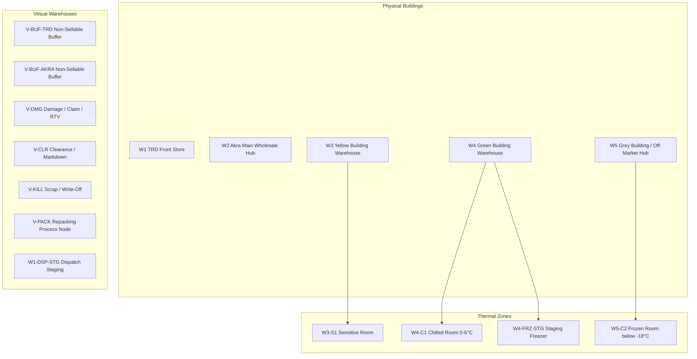

# BMTH ERP Phase 1 Flow Blueprint — Dispatch & Transfer Core

This document serves as the absolute **Single Source of Truth** for the core dispatch exception logic, transfer configurations, virtual location trees, and event names. All implementation plans (Chen) and code modifications (Gemini) must conform verbatim to this spec.

---

## 1. Location Tree & Virtual Warehouses Mapping

Our warehouse topology consists of **5 Physical Buildings** with embedded **Thermal Zones**, alongside **Virtual Status Locations** that are mapped as virtual warehouses for complete transactional and ledger consistency.

### Location Rules & Properties:
1. **W1-DSP-STG (Dispatch Staging)**: A virtual warehouse mapped under `W1`. Staged stock here is non-sellable for POS and reserved strictly for dispatch execution.
2. **W4-FRZ-STG (Staging Freezer)**: A small sub-zero freezer zone located physically inside Green Building Warehouse `W4`. Mapped as a sellable zone. Replenished from main frozen storage `W5-C2`.
3. **V-BUF-TRD / V-BUF-AKRA (Buffers)**: Segmented per Business Unit. Mapped as `is_sellable = false`. Used to hold mismatched or quarantined items during picking.
4. **V-DMG, V-CLR, V-KILL (Shared Virtual Warehouses)**: Global locations, but **every stock ledger entry must be tagged with the source BU** (`business_unit_id` from the source warehouse or transaction record) to ensure accurate accounting.

---

## 2. Dispatch Check Exception Policy

During the final exit scan at the dispatch gate, physical quantity shortages or over-picking exceptions are resolved dynamically by the system using strict criteria:

| Exception Case | Threshold / Trigger | System Actions & Resolution | Event Name |
| :--- | :--- | :--- | :--- |
| **Minor Shortage** | Shortage == 1 unit | Auto-adjust delivery order (DO) and invoice to match picked quantity. Proceed to dispatch immediately. | `SHORTAGE_AUTO_ADJUST` |
| **Major Shortage** | Shortage >= 2 units | Dispatch is hard-blocked. Requires a Supervisor's **Manager PIN override** and reason code to proceed. | `SHORTAGE_PIN_REQUIRED` |
| **Wrong Item Picked** | Mismatched SKU picked | Reject SKU at gate. The picker must physically move the item to the virtual buffer zone (`V-BUF-TRD` or `V-BUF-AKRA`). | `WRONG_ITEM_TO_BUFFER_ZONE` |
| **Over-Pick Upsell** | Scanned qty > Billed qty | Log as upsell. Prompt delivery rider to attempt upsell. Links transaction with potential add-on bills. | `OVER_PICK_TO_UPSELL` |
| **Customer Substitute** | Alternate SKU picked | Allowed if customer accepts substitute. Record replacement SKU and quantity. | `SUBSTITUTE_ACCEPTED` |

---

## 3. Akra $\rightarrow$ TRD Transfer Request Policy & Mode Logic

Replenishing `W1` (TRD Front Store) from `AKRA` wholesale hubs does not rely on a fixed `W2 -> W1` route. Instead, any active AKRA warehouse (`W2`, `W3`, `W4`, `W5`) can be designated as the replenishment source.

### Transfer Quantity Modes (`transfer_qty_mode`):
- **`SHORTAGE_ONLY`**: The transfer request is generated for the exact missing amount to fulfill open customer orders.
- **`FULL_ORDER_LINE`**: The transfer request is generated for the entire ordered line quantity.
- **`MANUAL_QTY`**: Operations manually key in the specific quantity to transfer.

### Picking & Staging Flow:
1. **Source Selection**: The supervisor designates the source AKRA warehouse.
2. **Per SKU Request**: Requests are compiled and tracked at the individual product SKU and order line level.
3. **W1 Handheld Behavior**: Picking on the W1 handheld is locked or guided dynamically depending on the selected `transfer_qty_mode`.

---

## 4. Operational Maintenance & Clearing Policies

1. **Buffer Zone Clearing Task**:
   * Buffer stock in `V-BUF-TRD` and `V-BUF-AKRA` must be resolved daily.
   * Supervisors review the buffer queue and issue a clearing action:
     * **Putback**: Move back to main shelves (sellable).
     * **Scrap**: Write-off to `V-KILL` (scrap ledger, posts JE).
     * **Mark Down**: Move to `V-CLR` (clearance sales channel, visible to TRD).
2. **Daily Closing Correction Summary**:
   * An automated report compiled at the end of each fiscal day summarizing all auto-adjustments, supervisor overrides, upsells, and buffer movements. Used by accounting to reconcile stock ledger variances.
