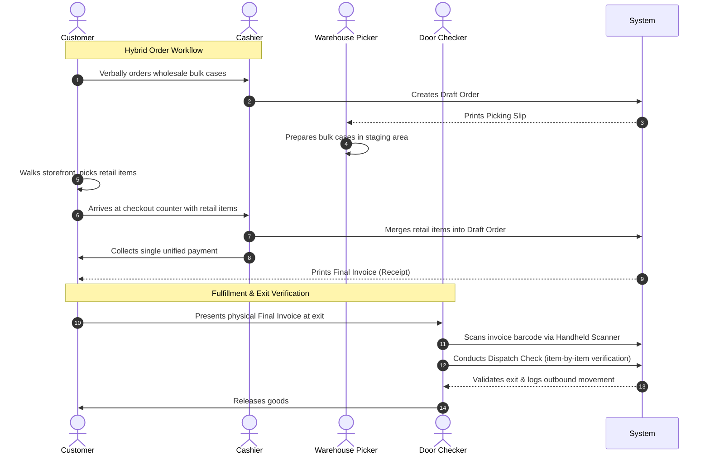

# Technical Analysis: ERP Requirement Specification (V2.0 Orion)
**Project Name:** Centralized Enterprise Resource Planning (ERP) System  
**Client:** Buymore (Thailand) Co., Ltd. (บริษัท บายมอร์ (ประเทศไทย) จำกัด)  
**Document Status:** Technical Specification Draft (ร่างข้อกำหนดทางเทคนิค)  
**Target Version:** 2.0 (Thai Formatted Version for Development Team)  

---

## 1. System Architecture & Corporate Setup
The system is designed as a **Single Database Environment** consolidating all corporate data under a single tenant. The highest corporate node is **Buymore (Thailand) Co., Ltd.**, which serves as the primary accounting, stock, and access control center.

```mermaid
graph TD
    BMTH["Buymore (Thailand) Co., Ltd. (Main Entity)"]
    DB[(Single Database Environment)]
    
    subgraph Multi-BU Isolation
        BU1["BU 1: TRD Bakermart (Retail / POS)"]
        BU2["BU 2: Akra Wholesale (B2B / OMS)"]
    end
    
    subgraph Unified Master Data
        MD1["Master SKU (สินค้า)"]
        MD2["Supplier Master (คู่ค้า)"]
        MD3["Customer Profile (ลูกค้า)"]
        MD4["Chart of Accounts (ผังบัญชี)"]
    end

    BMTH --> DB
    DB --> BU1
    DB --> BU2
    BU1 -.-> Unified
    BU2 -.-> Unified
    Unified --> Unified Master Data
    
    subgraph Cross-BU Financial Integration
        GL["General Ledger (สมุดรายวันทั่วไป)"]
        PL["Consolidated P&L & Tax Compliance"]
    end
    
    BU1 --> GL
    BU2 --> GL
    GL --> PL
```

### Key Technical Patterns:
*   **Multi-BU Isolation (Logical Partitioning):** Strict logical isolation at the database layer (via application scopes, role-based access control, and transaction filtering). Employees in one BU must not access or interfere with document flows, prices, or orders of another BU.
*   **Unified Master Data:** A single source of truth for items, partners, and accounting accounts. Denormalized fields or mapping tables handle BU-specific preferences (e.g., default UOM, specific pricing) without duplicating the master records.
*   **Cross-BU Financial Integration:** Every commercial event triggering inventory movements or sales in any BU posts immediately to a shared **General Ledger (GL)** for real-time consolidated P&L and compliant statutory reporting.

---

## 2. Business Unit Operational Workflows

### 2.1 BU 1: TRD Bakermart (Storefront Retail & Counter Sales)
Operating on a **Master Branch Model (สาขาต้นแบบ)** prepared for rapid horizontal scaling, the POS module must support four specialized transactional workflows:



#### POS Workflow Specifications:
1.  **Drive-Through Flow (ซื้อด่วนหน้าคลัง):** Optimized for single-screen, high-speed cash/QR transactions (`Quick Sale`). Cashier completes the sales document while warehouse workers simultaneously load bulk cases onto the customer's vehicle.
2.  **Pure Retail Flow (เดินเลือกซื้อเอง):** Standard retail checkouts scanning barcodes, calculating totals, deducting storefront inventory, and collecting payment.
3.  **Hybrid Order Flow (ผสมสินค้าปลีกและสินค้ายกลัง):** Enforces a multi-stage fulfillment sequence:
    *   Cashier opens a `Draft Order` for wholesale bulk items.
    *   Prints a `Picking Slip` for the warehouse crew to pick in advance.
    *   Customer browses retail aisles, gathering small loose items.
    *   Cashier recalls the `Draft Order`, merges retail items, and processes a single, unified payment.
    *   Generates the **Final Invoice**.
4.  **Pre-Order & Add-on Flow (สั่งล่วงหน้าและเพิ่มของหน้างาน):** Allows retrieval of active, pre-created phone/messaging draft orders to append items on-site before checkout.

#### Fulfillment Control:
*   **Order Versioning:** Track incremental document changes. A modifications trigger a `Delta Slip` printed at the warehouse showing only the variance (+/- items) to prevent double-picking.
*   **Dispatch Check:** Enforces an exit gate verification. The gatekeeper scans the barcode on the **Final Invoice** (earlier invoice versions are hard-blocked by the system) and verifies each item visually using a handheld scanner before authorizing release.

---

### 2.2 BU 2: Akra Wholesale (Warehouse OMS & Field Sales)
Designed as a **Counter-Service Order Management System (Counter-Service OMS)**. Customers have no warehouse access; transactions are serviced by internal sales desk operators or field sales agents.

#### Operational Specifications:
*   **Wholecase Strict Lock (ล็อกหน่วยขายส่ง):** Sales screens in the Akra OMS are technically restricted to display and trade products in bulk packaging units (e.g., "ลัง" - Case, or "กระสอบ" - Sack). Smaller storefront retail units are locked out of this interface to prevent packaging errors.
*   **Fulfillment & Cash Flow:** 
    $$\text{Sales Order Created} \longrightarrow \text{Picking Slip Printed} \longrightarrow \text{Goods Picked \& Staged} \longrightarrow \text{Payment Confirmed} \longrightarrow \text{Release}$$
*   **Field Sales Automation:** Optimized for tablets and mobile devices used by traveling field agents:
    *   **Geo-Tracking:** Enforces GPS check-ins at restaurants, hotels, and bakery factories.
    *   **Real-Time Sellable Stock:** Queries actual, non-allocated available stocks in the main warehouse to prevent over-promising.
    *   **Instant Quotation/SO:** Generates and queues orders instantly to the warehouse from the field.

---

## 3. Dynamic Pricing & Minimum Price Protection

Bakery raw materials operate on thin margins, necessitating a flexible pricing engine with strict controls:

```
                          [Customer Order Triggered]
                                      |
                      Is channel TRD or Akra Wholesale?
                         /                         \
                   [TRD Channel]               [Akra Channel]
                       /                             \
          Apply Tier Pricing Model             Apply Contract/Volume Model
          (T0, T1, T2, T3 Levels)              (Volume breaks + locked SKUs)
                       \                             /
                        \                           /
                      [Calculate Final Item Price]
                                    |
                       Is Price < SKU Min Price?
                               /         \
                             (No)        (Yes)
                             /             \
                      [Save Invoice]   [Hard Stop triggered]
                                            \
                                       Manager Override Code?
                                            /          \
                                         (Yes)         (No)
                                          /              \
                                    [Save Invoice]    [Block Save]
```

### 3.1 Pricing Modalities:
1.  **Channel-Specific Pricing:** Even if identical customer accounts buy the same SKU, walking into TRD triggers retail tier pricing, while ordering through Akra triggers wholesale rules. The profiles never bleed into each other.
2.  **TRD Bakermart Tier Pricing:** Mapped to member levels:
    *   `T0`: Standard Retail Price (ราคาปลีกปกติ)
    *   `T1`: General Member (ราคาสมาชิกทั่วไป)
    *   `T2`: Store/Bakery Member (ราคาสมาชิกร้านค้า)
    *   `T3`: Contract/Special Deal (ราคาสมาชิกตามดีลพิเศษ)
    *   **Price History Alert:** POS must alert the cashier of the exact historical price this customer paid for this item in their last transaction.
    *   **Mixed Discounts:** Supports volume grouping for mixed colors/styles (คละสีคละแบบ).
3.  **Akra Wholesale Contract & Volume Pricing:**
    *   Volume-based pricing breaks automatically calculated.
    *   **Customer-Specific Contracts:** Dual-level locking. Can enforce a set percentage discount at the invoice foot, or lock a firm price for a specific SKU (e.g., locking flour brand A at 400 THB/bag for Customer X while allowing manual adjustments on other items).
4.  **Minimum Price Protection (Hard Stop):**
    *   Every SKU has a strict database attribute: `Min Price` (ราคาขั้นต่ำสุด).
    *   While sales agents can negotiate discounts, if the manual price falls below `Min Price`, the system executes a **Hard Stop** blocking invoice saving.
    *   Bypassing requires entering manager override credentials.

---

## 4. Payment & Credit Control

The ERP maintains a robust risk mitigation module separating cash clients from credit lines:

*   **Cash-First Policy:** The core operational default is **Cash Before Delivery/Pickup** (cash or direct bank transfer) for all normal operations.
*   **Strict Credit Approval Workflow:** Applies to the high-revenue, high-risk B2B accounts (approx. 5% of customer base, but representing 15% of overall sales volume).
*   **Auto-Hold System Engine:** The credit engine automatically flags and locks a customer account to `On Hold` status if either of these conditions are met:
    
    $$\text{Total Outstanding Balance} > \text{Credit Limit}$$
    $$\text{or}$$
    $$\text{Invoice Aging Overdue} \ge 1 \text{ Day}$$

*   **System Lockout:** Once `On Hold`, both OMS and POS systems block opening any new orders/bills for this customer. Only an authorized executive can grant a temporary manual override.

---

## 5. WMS, Virtual Locations & UOM Architecture

### 5.1 Physical Warehouses (8 Locations)
Consists of physical areas categorized by thermal conditions and movement velocities:

| Warehouse Code | Warehouse Name / Real Location | Thermal Type | Operational Purpose |
| :--- | :--- | :--- | :--- |
| **W1** | TRD Bakermart Storefront | Ambient / Mixed | Front-of-house retail store. High-frequency transactions, high discrepancy risk. Integrated with **Auto-Replenishment** to pull stock from W2. |
| **W2** | Akra Wholesale Main Warehouse | Ambient | Primary wholesale warehouse. Main fulfillment center for case/bulk shipments. Equipped with heavy cargo lifts. |
| **W3** | Yellow Building (Fast-Moving) | Ambient | Main fast-moving storage area. Features **Zone S1 (Sensitive Room)**: an enclosed temperature-controlled space for highly meltable goods (chocolates, jellies, shredded pork). |
| **W4** | Green Building (Med-Moving) | Ambient | Packaging materials and grains bulk storage. Features **Zone C1 (Chilled Room)**: active cold storage (0-6 °C) for temperature-sensitive ingredients. |
| **W5** | Gray Building (Slow-Moving) | Ambient | Bulk overflow storage, used when W2, W3, and W4 are at capacity. Features **Zone C2 (Frozen Room)**: deep-freeze storage (below -18 °C) for frozen butter, cheese, and pastries. |

### 5.2 Virtual Warehouses (4 Status-Control Locations)
Virtual environments are technical states used to quarantine items and keep them out of standard sales channels:

```
               [Incoming Stock / Goods Received]
                               |
                   Are items ready for sale?
                    /                     \
                 (Yes)                   (No)
                  /                         \
     [Store in W1-W5 Physical]       [Route to Virtual quarantine]
     (Available for POS & OMS)               |
                                     Identify condition:
                                     - Staging / Cross-Docking -> V-BUF
                                     - Defective / RTV Claim   -> V-DMG
                                     - Near-expiry / Clearance -> V-CLR (POS visible)
                                     - Scrap / Tax Write-off   -> V-KILL (Locked)
```

1.  **V-BUF (Buffer / Cross-Docking):** Staging area for items not yet put away, cross-docking batches, or promotional gifts. (Non-Sellable).
2.  **V-DMG (Damage & Claim):** Quarantines damaged, expired, or defective items. Moving items here triggers a **Return to Vendor (RTV)** document or **Credit Note (CN)** workflow. (Non-Sellable).
3.  **V-CLR (Clearance):** Near-expiry or degraded stock. Special setting makes this virtual location visible *only* to TRD storefront POS terminals, enabling clearance sales at deep discounts. Differences are logged as marketing/markdown expenses.
4.  **V-KILL (Scrap & Write-off):** Scrap quarantine awaiting physical disposal. Moving stock here generates a **Write-off** document, deducting values from the accounting balance sheet and posting to **COGS Shrinkage/Spoilage** for tax compliance. (Strictly Non-Sellable).

### 5.3 Repacking & BOM Conversion (W1 Storefront)
Solves inventory tracking issues when loose storefront items are portioned from large bulk sacks:
*   **W1-BLK (Bulk Zone):** Back-of-store bulk storage (e.g., cocoa sacks of 25kg). Storefront POS is locked from billing units directly from this zone.
*   **W1-RTL (Retail Zone):** Storefront shelves displaying portioned, retail-ready items (e.g., cocoa bags of 1kg). POS scans and sells from here.
*   **V-PACK (Virtual Repacking WMS):** Staging area for BOM conversion:
    
$$\text{Move 1 Bag Cocoa (25kg) from W1-BLK} \longrightarrow \text{Hold in V-PACK} \longrightarrow \text{Repack Process} \longrightarrow \text{BOM Output: 25 Bags Cocoa (1kg)} \longrightarrow \text{Store in W1-RTL}$$

*   **Yield Loss / Shrinkage Tracking:** System forces inputting any portioning losses (e.g., powder spilled during repackaging) to charge them off as operational waste.

### 5.4 FEFO & UOM Rules
*   **Strict FEFO Enforcement:** Handheld scanners enforce picking from the oldest expiring batch. Scanning a newer lot displays an error and locks the screen. Overriding this requires entering a supervisor override PIN (e.g., from warehouse manager "คุณหมูหยอง").
*   **Base UOM Architecture:** Databases must store and compute stock balances solely in the **Base UOM** (smallest fractional unit) to eliminate decimal routing errors. The system UI dynamically aggregates balances into human-readable compound units (e.g., showing `2 cases, 4 packs, 3 pieces` instead of `147 pieces`).

---

## 6. Procurement & AI Analytics Engine

The purchasing module is integrated with predictive logic and strict transaction processing:

```
[Purchase Request (PR)] 
         │
[Purchase Order (PO)] ──> Sets default to Last Cost ──> Changes to `PO Opened` / `PO Pending Delivery`
         │
[Blind Receiving (BR)] ──> Hides ordered quantities from operators; supports splitting 1 PO into multiple BRs
         │
[Goods Receipt (GR)] ──> Compiled by warehouse manager from individual BRs
         │
[3-Way Matching] ──> System reconciles PO (Price/Qty) + GR (Received Qty) + Supplier Invoice
         │
[Completion] ──> Status -> `Completed`, posts journal entries, and releases stock to sellable physical locations
```

### 6.1 Purchasing Features:
*   **AI Portfolio Management:** Computes item performance to suggest product removals (**AI SKU Cut**) and monitors **NPD (New Product Development)** trial timelines.
*   **S-Curve Forecasting:** Forecasts purchasing schedules and inventory levels based on seasonal demand trends.
*   **Floating Items:** Allows operators to receive samples or promotional freebies lacking master records into **V-BUF** as non-sellable stock, awaiting formal SKU assignment by purchasing (`Master Data Conversion`).
*   **Rebate Management:** Tracks cumulative purchase totals from primary vendors (e.g., Raomifood, Bangkok Inter Food, Lam Soon) to automatically trigger rebate receivables in accounts when contract milestones are hit.

---

## 7. Accounting, Finance & System Integrations

### 7.1 Thai Taxation Compliance
Must fully support and automate local tax requirements:
*   **VAT Calculations:** Flexible 7% VAT handling (VAT-inclusive and VAT-exclusive configurations).
*   **Tax Documents:** Automated printing of POS Simplified Tax Invoices (ABB), Full Tax Invoices, and Withholding Tax certificates (WHT 1%, 3%, 5%) with physical Form 50 Twi generation.
*   **Automated GL Posting & Moving Average Cost:** Sales and completed POs trigger double-entry bookkeeping journal vouchers and recalculate inventory valuations using the **Moving Average Cost** method.
*   **Outsource Accounting Gateway:** Provides an external **Auditor** role with read-only access to ledger records and trial balances. Includes formatted export engines (Excel/CSV) tailored for importing directly into standard external accounting applications (Express, FlowAccount, PEAK).

### 7.2 Third-Party System Integrations
1.  **Hrzoft API (HR & Access Control):** Connects to the existing Hrzoft system. The ERP pulls employee names, departments, job titles, and statuses to dynamically create, update, or disable user profiles and allocate roles (**User Access Roles**) in the ERP, preventing double administration.
2.  **Handheld/Mobile Terminals:** Restful API gateways supporting mobile terminals for:
    *   WMS operations (put-away, stock taking, FEFO checks).
    *   Blind receiving (BR) on the docks.
    *   Field sales agents check-ins and order placement.
