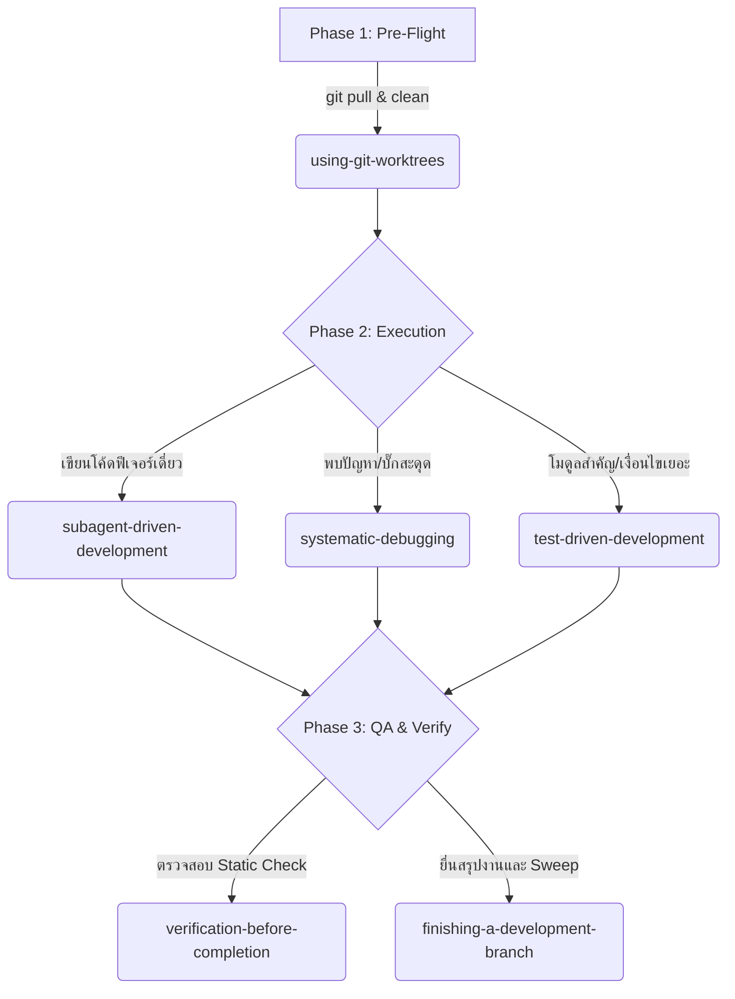

# ⚡ BUYMORE ERP — Superpowers Plugin Integration Guide

เอกสารฉบับนี้เป็นคู่มือแนะนำวิธีการเปิดใช้งานและดึงความสามารถจากชุดคำสั่งระบบ **"Superpowers" (Global Plugins & Workflow Skills)** ซึ่งเป็นความสามารถระบบพรีเมียมที่ติดตั้งข้ามแพลตฟอร์มอยู่ในเครื่องของนักพัฒนา ให้ทำงานร่วมกับ AI Hybrid Workflow (Chen, Gemini, Billy) ได้อย่างเต็มประสิทธิภาพและคุ้มค่าที่สุด

---

## 📌 1. Superpowers Skills Registry (แผนที่พิกัดไฟล์)

นี่คือไฟล์ทักษะที่เก็บไว้ในระดับ Global Cache บนเครื่องคอมพิวเตอร์ของคุณ เอเจนต์ทุกตัวสามารถคลิกหรือสั่งให้ใช้เครื่องมือ `view_file` เข้าไปอ่านข้อบังคับและกฎเฉพาะด้านได้ทันทีตาม Absolute Path ดังต่อไปนี้:

| ลำดับ | ชื่อทักษะ (Skill Name) | จุดประสงค์หลัก / ฟังก์ชันการคุ้มค่า | Absolute Path ที่ต้องเรียกอ่านผ่าน `view_file` |
| :--- | :--- | :--- | :--- |
| 1 | **using-superpowers** | ควบคุมและจัดลำดับความสำคัญของทักษะต่าง ๆ | `file:///C:/Users/AKRA-Panich-Front/.claude/plugins/cache/claude-plugins-official/superpowers/5.1.0/skills/using-superpowers/SKILL.md` |
| 2 | **subagent-driven-development** | สปอว์น Subagent แยกงานอิสระพร้อมกลไกสองรีวิว | `file:///C:/Users/AKRA-Panich-Front/.claude/plugins/cache/claude-plugins-official/superpowers/5.1.0/skills/subagent-driven-development/SKILL.md` |
| 3 | **executing-plans** | ขั้นตอนการลงมือทำแผนงานแบบทีละขั้นตอนไม่ให้ตกหล่น | `file:///C:/Users/AKRA-Panich-Front/.claude/plugins/cache/claude-plugins-official/superpowers/5.1.0/skills/executing-plans/SKILL.md` |
| 4 | **systematic-debugging** | การแกะบั๊กระดับรากลึกแบบเป็นระบบ (ไม่สุ่มแก้) | `file:///C:/Users/AKRA-Panich-Front/.claude/plugins/cache/claude-plugins-official/superpowers/5.1.0/skills/systematic-debugging/SKILL.md` |
| 5 | **test-driven-development** | การพัฒนาและเขียน Unit/Integration Test นำหน้าโค้ดจริง | `file:///C:/Users/AKRA-Panich-Front/.claude/plugins/cache/claude-plugins-official/superpowers/5.1.0/skills/test-driven-development/SKILL.md` |
| 6 | **using-git-worktrees** | แยกหน้าต่างโฟลเดอร์ทำงานคู่ขนานตามกิ่ง Git สาขาฟีเจอร์ | `file:///C:/Users/AKRA-Panich-Front/.claude/plugins/cache/claude-plugins-official/superpowers/5.1.0/skills/using-git-worktrees/SKILL.md` |
| 7 | **verification-before-completion**| การทำ Static verification, build, lint ก่อนยืนยันเสร็จงาน | `file:///C:/Users/AKRA-Panich-Front/.claude/plugins/cache/claude-plugins-official/superpowers/5.1.0/skills/verification-before-completion/SKILL.md` |
| 8 | **finishing-a-development-branch**| การสรุปงาน ยื่นรีวิว และเตรียมสวีปแทร็กเข้า Archive | `file:///C:/Users/AKRA-Panich-Front/.claude/plugins/cache/claude-plugins-official/superpowers/5.1.0/skills/finishing-a-development-branch/SKILL.md` |
| 9 | **brainstorming** | การทำโมเดลจำลองความคิด ระบุผลกระทบก่อนร่างแผน | `file:///C:/Users/AKRA-Panich-Front/.claude/plugins/cache/claude-plugins-official/superpowers/5.1.0/skills/brainstorming/SKILL.md` |
| 10 | **writing-plans** | การร่างเช็คลิสต์ `plan.md` ที่สมบูรณ์แบบของ Chen | `file:///C:/Users/AKRA-Panich-Front/.claude/plugins/cache/claude-plugins-official/superpowers/5.1.0/skills/writing-plans/SKILL.md` |
| 11 | **requesting-code-review** | การเขียน Pull Request หรือใบยื่นเสนอขอ Billy รีวิวงาน | `file:///C:/Users/AKRA-Panich-Front/.claude/plugins/cache/claude-plugins-official/superpowers/5.1.0/skills/requesting-code-review/SKILL.md` |
| 12 | **receiving-code-review** | วิธีแก้ไขงานเมื่อ Billy พบจุดบกพร่องตาม Rework Plan | `file:///C:/Users/AKRA-Panich-Front/.claude/plugins/cache/claude-plugins-official/superpowers/5.1.0/skills/receiving-code-review/SKILL.md` |
| 13 | **writing-skills** | การสร้างกฎเฉพาะตัวย่อย ๆ เพิ่มเติมในอนาคต | `file:///C:/Users/AKRA-Panich-Front/.claude/plugins/cache/claude-plugins-official/superpowers/5.1.0/skills/writing-skills/SKILL.md` |
| 14 | **dispatching-parallel-agents** | การบริหารเอเจนต์ทำงานคู่ขนานหลายตัวพร้อมกัน | `file:///C:/Users/AKRA-Panich-Front/.claude/plugins/cache/claude-plugins-official/superpowers/5.1.0/skills/dispatching-parallel-agents/SKILL.md` |

---

## 🔄 2. การผสาน Superpowers เข้าสู่กระบวนการหลัก (Pipeline Mapping)

เพื่อให้เอเจนต์ดึงมาใช้แบบคุ้มค่าที่สุด ระบบจะนำมาผูกติดไว้กับ **กระบวนการทำงานหลัก (Workflow Phases)** ดังนี้:

### 1) ในช่วง Pre-Flight Checklist
* **เงื่อนไข:** ก่อนเริ่มลงมือทำแทร็กใด ๆ ที่มีสถานะ `Active` หรือ `Rework Required`
* **พฤติกรรมเอเจนต์:** ต้องเปิดอ่านไฟล์ `using-git-worktrees` ทันทีก่อนเขียนโค้ด เพื่อทำการจัดเตรียม Worktree หรือแยกกิ่งพัฒนาที่ปลอดภัย ไม่ให้ไปรบกวนกิ่งหลัก

### 2) ในช่วงลงมือทำงาน (Execution Phase)
* **เงื่อนไข:** เมื่อได้รับคำสั่ง `Go` หรือเริ่มทำฟีเจอร์ใหม่
* **พฤติกรรมเอเจนต์:** 
  1. เปิดโหลดสกิล `subagent-driven-development` เข้ามาในเซสชัน
  2. ใช้เครื่องมือ **`define_subagent`** และ **`invoke_subagent`** ในการแยกสร้างเอเจนต์จำเพาะ (เช่น **Implementer Subagent** ทำงานเขียนไฟล์, **Spec Reviewer Subagent** ทำงานสอบย้อนหาผลกระทบ) ทำงานคู่ขนานกัน
  3. หากเป็นส่วนคิดเงินหรือความปลอดภัยของข้อมูล (เช่น *Pricing Engine*, *Credit Control*) เอเจนต์ต้องเปิดอ่าน `test-driven-development` เพื่อรันเขียนชุดทดสอบ (Unit Test) นำร่องก่อนเขียนฟังก์ชันเสมอ

### 3) เมื่อเกิดข้อผิดพลาดในการตรวจสอบหรือคอมไพล์ (Debugging & QA Phase)
* **เงื่อนไข:** เมื่อมี Error เกิดขึ้น หรือผลตรวจสอบจาก Billy เป็น `Rework Required`
* **พฤติกรรมเอเจนต์:** ต้องระงับการลองผิดลองถูกทันที! และเปิดใช้ไฟล์ `systematic-debugging` เพื่อตรวจวิเคราะห์ Root-Cause อย่างเป็นระบบก่อนเริ่มเขียนพูลเพื่อแก้ไข

### 4) ในช่วงปิดแทร็กงาน (Verification & Completion Phase)
* **เงื่อนไข:** เมื่อเขียนโค้ดตามแผนครบถ้วน
* **พฤติกรรมเอเจนต์:** เรียกเปิดสกิล `verification-before-completion` เพื่อทำความสะอาดโค้ด รันคำสั่ง `npx tsc --noEmit` ยืนยัน และสวีปแทร็กด้วย `finishing-a-development-branch`

---

## 🚀 3. วิธีการกระตุ้นให้เอเจนต์ทำงานอย่างมีพลัง (How to prompt for maximum leverage)

หากต้องการให้ Gemini หรือ Claude นำความพรีเมียมเหล่านี้มาพัฒนาฟีเจอร์ของ **BUYMORE ERP** ได้ดีที่สุด ให้ใส่ความคาดหวังและพิกัดลงในคำสั่งหรือพิมพ์ในหน้าแชทดังนี้:

### คำสั่งสำหรับจัดทำแผนงาน (Chen/Claude):
> **"Architect: [โจทย์ฟีเจอร์ เช่น อนุมัติการคืนสินค้า]"**
> *( Chen จะดึงสกิล `brainstorming` และ `writing-plans` มาสร้างโครงเช็คลิสต์ที่ครอบคลุม Transaction, DB Sequence, และ Edge-case อย่างละเอียด )*

### คำสั่งสำหรับให้ลงมือทำ (Gemini):
> **"Go! และให้ดึงพลังจาก `subagent-driven-development` ด้วยการเปิดใช้ Absolute Path ทักษะนี้ เพื่อสปอว์น Subagent ทำหน้าที่ Implement และทวนสอบความถูกต้องแบบ 2-Stage Review (Spec และ Quality) อย่างเข้มงวด"**

### คำสั่งแกะข้อผิดพลาดทราฟฟิกสูง:
> **"วิเคราะห์แก้ปัญหานี้โดยใช้ `systematic-debugging` ตามแบบฉบับ Global Plugin และรายงานผลวิเคราะห์แบบเป็นขั้นบันไดก่อนลงมือแก้ไขจริง"**
